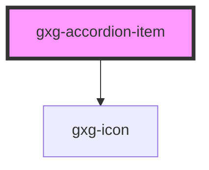

# gxg-template

<!-- Auto Generated Below -->

## Properties

| Property              | Attribute    | Description                                          | Type                               | Default       |
| --------------------- | ------------ | ---------------------------------------------------- | ---------------------------------- | ------------- |
| `disabled`            | `disabled`   | The state of the toggle. Whether is disabled or not. | `boolean`                          | `false`       |
| `itemId` _(required)_ | `item-id`    | The toggle id                                        | `string`                           | `undefined`   |
| `itemTitle`           | `item-title` | The toggle label                                     | `string`                           | `undefined`   |
| `mode`                | `mode`       | The aesthetical mode                                 | `"boxed" \| "classical" \| "slim"` | `"classical"` |
| `open`                | `open`       | The toggle state                                     | `boolean`                          | `false`       |
| `padding`             | `padding`    | The padding                                          | `"s" \| "xs" \| "xxs"`             | `"xs"`        |

## Events

| Event                  | Description | Type               |
| ---------------------- | ----------- | ------------------ |
| `accordionItemClicked` |             | `CustomEvent<any>` |
| `accordionItemLoaded`  |             | `CustomEvent<any>` |

## Dependencies

### Depends on

- [gxg-icon](../icon)

### Graph

---

_Built with [StencilJS](https://stenciljs.com/)_
