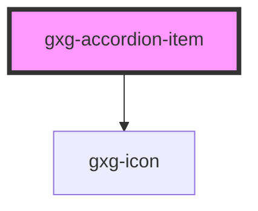

# gxg-accordion

<h2>Notes</h2>
<ul>
   <li>To make the accordion work, wrap any number of <code>gxg-accordion-item</code>'s inside a <code>gxg-accordion</code></li>
   <li>To work properly, the accordion expects each <code>gxg-accordion-item</code> to have a unique <code>item-id</code></li>  
   <li>You can set padding to an accordion individualy by setting one of the available padding values to an <code>gxg-accordion-item</code>, or to all of the accordion-item's by setting the padding value on the <code>gxg-accordion</code></li>
   <li>accordion mode <em>classical</em> and <em>boxed</em> accept a subtitle, which must be provided as a <em>slotted content</em> inside the <code>gxg-accordion-item</code>: <code>&lt;p slot="subtitle"&gt;This is the subtitle&lt;/p&gt;</code>. The subtitle will appear under the title. Checkout the examples for the <a href="/story/other-accordion--classical-subtitle">classical mode</a>, and <a href="/story/other-accordion--boxed-subtitle">boxed mode</a>.</li>
   <li>accordion mode <em>boxed</em> will also accept meta-data, which must be provided as a <em>slotted content</em> inside the <code>gxg-accordion-item</code>: <code>&lt;p slot="meta"&gt;This is the meta-data&lt;/p&gt;</code>. The meta-data will appear on the right, just before the arrow. Checkout the example for the <a href="/story/other-accordion--boxed-meta">boxed mode</a>.</li>
</ul>

## Properties

| Property         | Attribute          | Description                                                                                 | Type                                                   | Default       |
| ---------------- | ------------------ | ------------------------------------------------------------------------------------------- | ------------------------------------------------------ | ------------- |
| `disabled`       | `disabled`         | If this attribute is present, all of the accordion-items will be disabled and not focusable | `boolean`                                              | `false`       |
| `maxWidth`       | `max-width`        | The accordion max-width                                                                     | `string`                                               | `"100%"`      |
| `mode`           | `mode`             | The accordion flavor                                                                        | `"boxed" \| "classical" \| "slim"`                     | `"classical"` |
| `padding`        | `padding`          | The accoridion padding (internal spacing)                                                   | `"l" \| "m" \| "s" \| "xl" \| "xs" \| "xxl" \| "xxxl"` | `"xs"`        |
| `singleItemOpen` | `single-item-open` | If this attribute is present, only one accordion-item can be open at the same time          | `boolean`                                              | `false`       |  |

# gxg-accordion-item

<!-- Auto Generated Below -->

## Properties

| Property              | Attribute    | Description                                                                                                          | Type                                                   | Default       |
| --------------------- | ------------ | -------------------------------------------------------------------------------------------------------------------- | ------------------------------------------------------ | ------------- |
| `disabled`            | `disabled`   | The presence of this attribute makes the accordion-item disabled and not focusable                                   | `boolean`                                              | `false`       |
| `itemId` _(required)_ | `item-id`    | The accordion id                                                                                                     | `string`                                               | `undefined`   |
| `itemTitle`           | `item-title` | The accordion title                                                                                                  | `string`                                               | `undefined`   |
| `mode`                | `mode`       | The accordion flavor (No need to set this attribute on each of the the accordion-item's, only once at gxg-accordion) | `"boxed" \| "classical" \| "slim"`                     | `"classical"` |
| `padding`             | `padding`    |                                                                                                                      | `"l" \| "m" \| "s" \| "xl" \| "xs" \| "xxl" \| "xxxl"` | `"s"`         |
| `status`              | `status`     | Set the status to "open" if you want the accordion-item open by default                                              | `"closed" \| "open"`                                   | `"closed"`    |

## Events

| Event                   | Description | Type               |
| ----------------------- | ----------- | ------------------ |
| `accordionItemClicked`  |             | `CustomEvent<any>` |
| `accordionItemLoaded`   |             | `CustomEvent<any>` |
| `accordionTitleClicked` |             | `CustomEvent<any>` |

## Dependencies

### Depends on

- [gxg-icon](../icon)

### Graph

---

_Built with [StencilJS](https://stenciljs.com/)_
