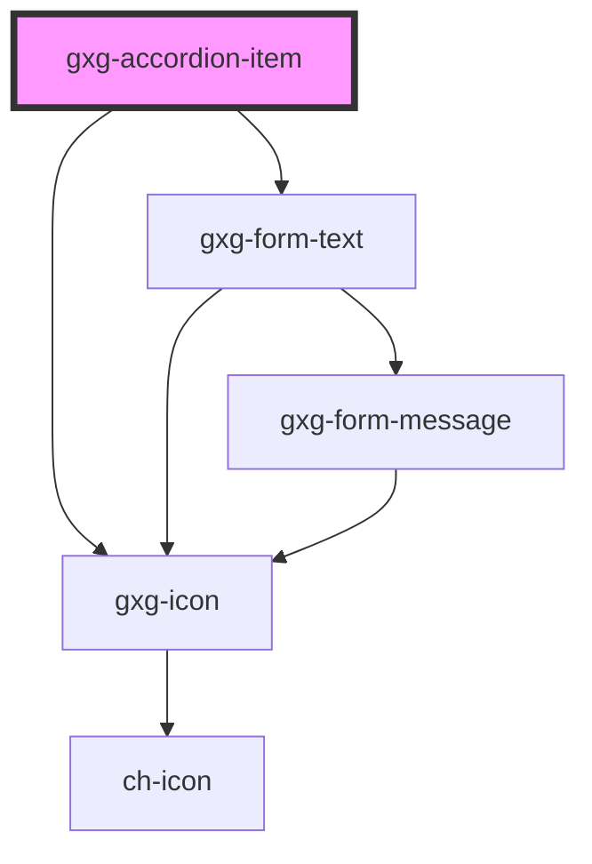

# gxg-accordion

<h2>Notes</h2>
<ul>
   <li>Wrap any number of <code>gxg-accordion-item</code>'s inside a <code>gxg-accordion</code></li>
   <li>To work properly, the accordion expects each <code>gxg-accordion-item</code> to have a unique <code>item-id</code></li>  
   <li>You can remove the padding on one <code>gxg-accordion-item</code> by setting the <code>no-padding</code> attribute on it, or to all of the accordion-item's by setting the <code>no-padding</code> attribute on the <code>gxg-accordion</code> component.</li>
   <li>accordion mode <em>classical</em> and <em>boxed</em> can accept a subtitle, which must be provided as an attribute: <code>&lt;gxg-accordion-item subtitle="some subtitle"&gt;</code>. The subtitle will appear under the title. Checkout the examples for the <a target="_blank" href="/story/other-accordion--classical-subtitle">classical mode</a>, and <a target="_blank" href="/story/other-accordion--boxed-subtitle">boxed mode</a>.</li>
   <li>accordion mode <em>boxed</em> will also accept meta-data, which must be provided as a <em>slotted content</em> inside the <code>gxg-accordion-item</code>: <code>&lt;p slot="meta"&gt;This is the meta-data&lt;/p&gt;</code>. The meta-data will appear on the right, just before the arrow. Checkout the example for the <a href="/story/other-accordion--boxed-meta">boxed mode</a>.</li>
   <li>accordion mode <em>classical</em> and <em>boxed</em> titles can be editable: Add the "editable-title" attribute to an <code>accordion-item</code> to make the title editable (the item must be opened).</li>
</ul>

## Properties

| Property         | Attribute          | Description                                                                                                                                                                 | Type                                            | Default       |
| ---------------- | ------------------ | --------------------------------------------------------------------------------------------------------------------------------------------------------------------------- | ----------------------------------------------- | ------------- |
| `disabled`       | `disabled`         | The presence of this attribute makes all of the accordion-items disabled and not focusable                                                                                  | `boolean`                                       | `false`       |
| `maxWidth`       | `max-width`        | The accordion max-width                                                                                                                                                     | `string`                                        | `"100%"`      |
| `mode`           | `mode`             | The accordion flavor                                                                                                                                                        | `"boxed" \| "classical" \| "minimal" \| "slim"` | `"classical"` |
| `noPadding`      | `no-padding`       | The presence of this attribues removes the padding (internal spacing) from the accordion items containers. This property only applies for the "classical" or "boxed" modes. | `boolean`                                       | `false`       |
| `singleItemOpen` | `single-item-open` | If this attribute is present, only one accordion-item can be open at the same time                                                                                          | `boolean`                                       | `false`       |

# gxg-accordion-item

<!-- Auto Generated Below -->

## Properties

| Property              | Attribute        | Description                                                                                                          | Type                                            | Default       |
| --------------------- | ---------------- | -------------------------------------------------------------------------------------------------------------------- | ----------------------------------------------- | ------------- |
| `disabled`            | `disabled`       | The presence of this attribute makes the accordion-item disabled and not focusable                                   | `boolean`                                       | `false`       |
| `editableTitle`       | `editable-title` | The presence of this attribute makes the accordion title editable                                                    | `boolean`                                       | `false`       |
| `itemId` _(required)_ | `item-id`        | The accordion id                                                                                                     | `string`                                        | `undefined`   |
| `itemSubtitle`        | `item-subtitle`  | The accordion subtitle (optional)                                                                                    | `string`                                        | `null`        |
| `itemTitle`           | `item-title`     | The accordion title                                                                                                  | `string`                                        | `undefined`   |
| `mode`                | `mode`           | The accordion flavor (No need to set this attribute on each of the the accordion-item's, only once at gxg-accordion) | `"boxed" \| "classical" \| "minimal" \| "slim"` | `"classical"` |
| `status`              | `status`         | Set the status to "open" if you want the accordion-item open by default                                              | `"closed" \| "open"`                            | `"closed"`    |
| `titleIcon`           | `title-icon`     | The accordion title icon                                                                                             | `string`                                        | `null`        |

## Events

| Event                   | Description                                                                                     | Type               |
| ----------------------- | ----------------------------------------------------------------------------------------------- | ------------------ |
| `accordionItemClicked`  | This event is for internal use                                                                  | `CustomEvent<any>` |
| `accordionItemLoaded`   | This event is for internal use                                                                  | `CustomEvent<any>` |
| `accordionTitleClicked` | Subscribe to this event to know when the "title" was clicked                                    | `CustomEvent<any>` |
| `titleChanged`          | If "editable-title" attribute is present, this event emmits the title value when it has changed | `CustomEvent<any>` |

## Dependencies

### Depends on

- [gxg-icon](../icon)
- [gxg-form-text](../form-text)

### Graph

---

_Built with [StencilJS](https://stenciljs.com/)_
