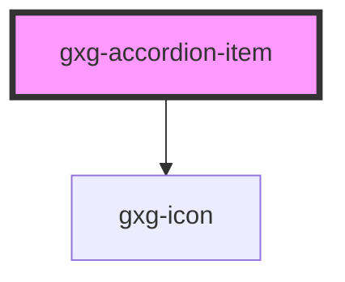

<h2>Notes</h2>
<ul>
   <li>To make the accordion work, wrap any number of <code>gxg-accordion-item</code>'s inside an <code>gxg-accordion</code> component</li>
   <li>The accordion expects each <code>gxg-accordion-item</code> to have a unique id identifier to work properly</li>  
   <li>You can set padding to an accordion individualy by setting the value to an <code>gxg-accordion-item</code>, or to all of the accordions by setting the padding on the <code>gxg-accordion</code></li>
</ul>

# gxg-accordion

## Properties

| Property         | Attribute          | Description                                                                                 | Type                               | Default       |
| ---------------- | ------------------ | ------------------------------------------------------------------------------------------- | ---------------------------------- | ------------- |
| `disabled`       | `disabled`         | If this attribute is present, all of the accordion-items will be disabled and not focusable | `boolean`                          | `false`       |
| `fullWidth`      | `full-width`       | Sets the width of the accordion to full-width                                               | `boolean`                          | `false`       |
| `maxWidth`       | `max-width`        | The accordion max-width                                                                     | `string`                           | `"360px"`     |
| `mode`           | `mode`             | The accordion flavor                                                                        | `"boxed" \| "classical" \| "slim"` | `"classical"` |
| `singleItemOpen` | `single-item-open` | If this attribute is present, only one accordion-item can be open at the same time          | `boolean`                          | `false`       |

# gxg-accordion-item

<!-- Auto Generated Below -->

## Properties

| Property              | Attribute    | Description                                                                        | Type                                                   | Default       |
| --------------------- | ------------ | ---------------------------------------------------------------------------------- | ------------------------------------------------------ | ------------- |
| `disabled`            | `disabled`   | If this attribute is present the accordion-item will be disabled and not focusable | `boolean`                                              | `false`       |
| `itemId` _(required)_ | `item-id`    | The accordion id                                                                   | `string`                                               | `undefined`   |
| `itemTitle`           | `item-title` | The accordion title                                                                | `string`                                               | `undefined`   |
| `mode`                | `mode`       | The accordion flavor                                                               | `"boxed" \| "classical" \| "slim"`                     | `"classical"` |
| `padding`             | `padding`    |                                                                                    | `"l" \| "m" \| "s" \| "xl" \| "xs" \| "xxl" \| "xxxl"` | `"s"`         |
| `status`              | `status`     | Set the status to "open" if you want the accordion-item open by default            | `"closed" \| "open"`                                   | `"closed"`    |

## Events

| Event                  | Description | Type               |
| ---------------------- | ----------- | ------------------ |
| `accordionItemClicked` |             | `CustomEvent<any>` |
| `accordionItemLoaded`  |             | `CustomEvent<any>` |

## Dependencies

### Depends on

- [gxg-icon](../icon)

### Graph

---

_Built with [StencilJS](https://stenciljs.com/)_
