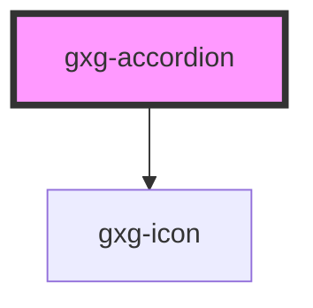

# gxg-template

<!-- Auto Generated Below -->

## Properties

| Property   | Attribute   | Description                                                                       | Type      | Default |
| ---------- | ----------- | --------------------------------------------------------------------------------- | --------- | ------- |
| `disabled` | `disabled`  | The state of the toggle. Whether is disabled or not. Possible values: false, true | `boolean` | `false` |
| `open`     | `open`      | The toggle state                                                                  | `boolean` | `false` |
| `tabTitle` | `tab-title` | The toggle label                                                                  | `string`  | `"tab"` |

## Events

| Event        | Description | Type               |
| ------------ | ----------- | ------------------ |
| `tabClicked` |             | `CustomEvent<any>` |

## Dependencies

### Depends on

- [gxg-icon](../icon)

### Graph

---

_Built with [StencilJS](https://stenciljs.com/)_
