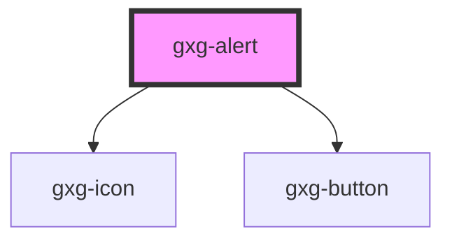

# gxg-button

<!-- Auto Generated Below -->

## Properties

| Property     | Attribute     | Description | Type                                               | Default       |
| ------------ | ------------- | ----------- | -------------------------------------------------- | ------------- |
| `active`     | `active`      |             | `boolean`                                          | `true`        |
| `alertTitle` | `alert-title` |             | `string`                                           | `undefined`   |
| `something`  | `something`   |             | `string`                                           | `undefined`   |
| `type`       | `type`        |             | `"error" \| "more-info" \| "success" \| "warning"` | `"more-info"` |

## Dependencies

### Depends on

- [gxg-icon](../icon)
- [gxg-button](../button)

### Graph

---

_Built with [StencilJS](https://stenciljs.com/)_
