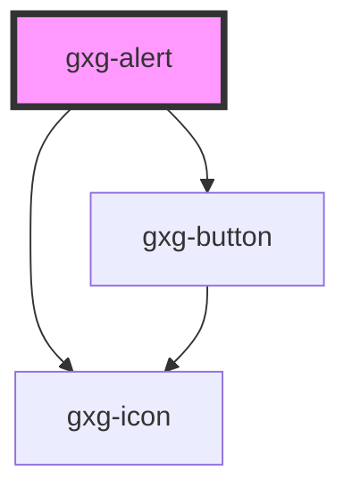

# gxg-alert

<h2>Using an alert</h2>
<ol>
  <li>Include the gx-alert component: <code>&lt;gxg-alert&gt;&lt;/gxg-alert&gt;</code></li>
  <li>Decide and define the type of alert that you would like to use, by setting the <em>type</em> property to one of the available type of alerts: "more-info", "success", "warning", or "error". Each type of alert comes with a different color scheme. That is the only difference.</li>
  <li>Set an optional title, by setting the <em>alert-title</em> property.</li>
  <li>Set the alert message, by adding the text inside the component (between the opening and closing tags). The message is slotted content.</li>
  <li>Set the alert position, by setting the <em>position</em> property equal to any of the available options: "left", "center", or "right". Default value is "left".</li>
  <li>Set the distance you want the alert to be appear from the left, bottom, or right sides of the container, by setting the <em>left</em>, <em>bottom</em>, or <em>right</em> properties to a value in pixels. Default value for the three properties is zero. In example: If you would like the alert to appear on the right side, with a "15px" distance from the right side, and "15px" distance from the bottom, set the <em>position</em> property to "right", and then <em>right</em> and <em>bottom</em> properties to "15px".</li>
  <li>You can also set the amount of time the alert will be visible before hidding under the container, by setting the <em>active-time</em> property to a value in miliseconds. Default amount is "3500" miliseconds.</li>
</ol>

<!-- Auto Generated Below -->

## Properties

| Property     | Attribute     | Description                                                                       | Type                                                                          | Default       |
| ------------ | ------------- | --------------------------------------------------------------------------------- | ----------------------------------------------------------------------------- | ------------- |
| `active`     | `active`      | Wether the alert is active (visible) or not (not visible).                        | `boolean`                                                                     | `false`       |
| `activeTime` | `active-time` | The amount of miliseconds the alert is visible before hidding under the document. | `"fast" \| "regular" \| "slow" \| "xfast" \| "xslow" \| "xxfast" \| "xxslow"` | `"regular"`   |
| `alertTitle` | `alert-title` | The alert title (optional)                                                        | `string`                                                                      | `undefined`   |
| `bottom`     | `bottom`      | The alert bottom position value                                                   | `"0" \| "l" \| "m" \| "s" \| "xl" \| "xs"`                                    | `"xs"`        |
| `fullWidth`  | `full-width`  | This property makes the component full-width                                      | `boolean`                                                                     | `false`       |
| `left`       | `left`        | The alert left position value                                                     | `"0" \| "l" \| "m" \| "s" \| "xl" \| "xs"`                                    | `"xs"`        |
| `leftRight`  | `left-right`  | The alert right position value                                                    | `"0" \| "l" \| "m" \| "s" \| "xl" \| "xs"`                                    | `"xs"`        |
| `position`   | `position`    | The alert position.                                                               | `"center" \| "left" \| "right"`                                               | `"left"`      |
| `right`      | `right`       | The alert right position value                                                    | `"0" \| "l" \| "m" \| "s" \| "xl" \| "xs"`                                    | `"xs"`        |
| `type`       | `type`        | The type of alert                                                                 | `"error" \| "more-info" \| "success" \| "warning"`                            | `"more-info"` |
| `width`      | `width`       | The alert width                                                                   | `string`                                                                      | `"350px"`     |

## Dependencies

### Depends on

- [gxg-icon](../icon)
- [gxg-button](../button)

### Graph

---

_Built with [StencilJS](https://stenciljs.com/)_
