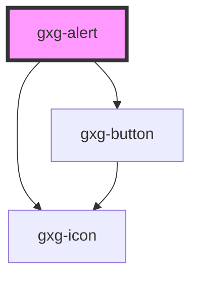

# gxg-alert

<!-- Auto Generated Below -->

## Properties

| Property     | Attribute     | Description                                                               | Type                                                                          | Default     |
| ------------ | ------------- | ------------------------------------------------------------------------- | ----------------------------------------------------------------------------- | ----------- |
| `active`     | `active`      | Wether the alert is active (visible) or hidden                            | `boolean`                                                                     | `false`     |
| `activeTime` | `active-time` | The amount of time the alert is visible before hidding under the document | `"fast" \| "regular" \| "slow" \| "xfast" \| "xslow" \| "xxfast" \| "xxslow"` | `"regular"` |
| `alertTitle` | `alert-title` | The alert title (optional)                                                | `string`                                                                      | `undefined` |
| `bottom`     | `bottom`      | The spacing between the alert and the bottom side of the document         | `"l" \| "m" \| "no-space" \| "s" \| "xl" \| "xs"`                             | `"xs"`      |
| `fullWidth`  | `full-width`  | The presence of this attribute makes the component full-width             | `boolean`                                                                     | `false`     |
| `leftRight`  | `left-right`  | The spacing between the alert, and the left or right side of the document | `"l" \| "m" \| "no-space" \| "s" \| "xl" \| "xs"`                             | `"xs"`      |
| `position`   | `position`    | The alert position on the X axis                                          | `"center" \| "left" \| "right"`                                               | `"left"`    |
| `type`       | `type`        | The alert flavor                                                          | `"error" \| "notice" \| "success" \| "warning"`                               | `"notice"`  |
| `width`      | `width`       | The alert width                                                           | `string`                                                                      | `"350px"`   |

## Dependencies

### Depends on

- [gxg-icon](../icon)
- [gxg-button](../button)

### Graph

---

_Built with [StencilJS](https://stenciljs.com/)_
