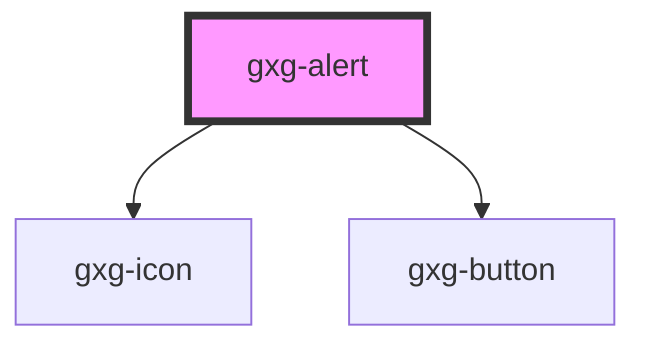

# gxg-alert

The alert message, is not a property, but the component content (slot).
Alert component has a fixed position, and, when active, it appears on the bottom left corner of the window.
"active" attribute can be set to false, by clicking the close icon, or, by default, after 2 seconds.

<!-- Auto Generated Below -->

## Properties

| Property     | Attribute     | Description                                                                            | Type                                               | Default       |
| ------------ | ------------- | -------------------------------------------------------------------------------------- | -------------------------------------------------- | ------------- |
| `active`     | `active`      | An attribute that determines wether the alert is active (visible) or not (not visible) | `boolean`                                          | `undefined`   |
| `alertTitle` | `alert-title` | The title                                                                              | `string`                                           | `undefined`   |
| `type`       | `type`        | The type of alert Possible values: more-info, error, warning, success                  | `"error" \| "more-info" \| "success" \| "warning"` | `"more-info"` |

## Dependencies

### Depends on

- [gxg-icon](../icon)
- [gxg-button](../button)

### Graph

---

_Built with [StencilJS](https://stenciljs.com/)_
