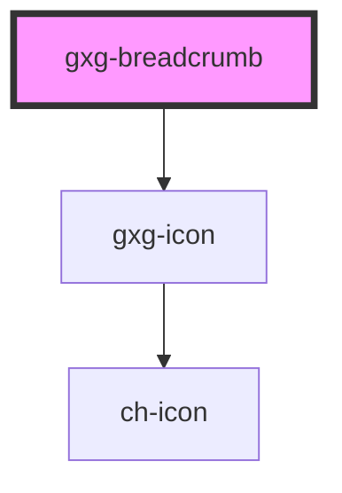

# gxg-breadcrumb

<!-- Auto Generated Below -->

## Properties

| Property | Attribute | Description                    | Type     | Default     |
| -------- | --------- | ------------------------------ | -------- | ----------- |
| `icon`   | `icon`    | The breadcrumb icon (optional) | `string` | `undefined` |

## Events

| Event               | Description                         | Type               |
| ------------------- | ----------------------------------- | ------------------ |
| `breadcrumbClicked` | This event emmits the breadcrumb id | `CustomEvent<any>` |

## Dependencies

### Depends on

- [gxg-icon](../icon)

### Graph

---

_Built with [StencilJS](https://stenciljs.com/)_
