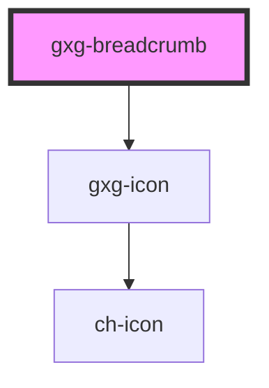

# gxg-breadcrumbs

## Properties

| Property | Attribute | Description                    | Type     | Default     |
| -------- | --------- | ------------------------------ | -------- | ----------- |
| `icon`   | `icon`    | The breadcrumb icon (optional) | `string` | `undefined` |
| `id`     | `id`      | The breadcrumb id              | `string` | `undefined` |

## Events

| Event               | Description                         | Type               |
| ------------------- | ----------------------------------- | ------------------ |
| `breadcrumbClicked` | This event emmits the breadcrumb id | `CustomEvent<any>` |

## Dependencies

### Depends on

- [gxg-icon](../icon)

### Graph



<!-- Auto Generated Below -->


## Usage

### Usage

```
<gxg-breadcrumbs id="breadcrumbs">
    <gxg-breadcrumb id="main-table" icon="objects/table">MainTable</gxg-breadcrumb>
    <gxg-breadcrumb id="grid" icon="objects/table">Grid</gxg-breadcrumb>
    <gxg-breadcrumb id="image" icon="objects/image">Image</gxg-breadcrumb>
</gxg-breadcrumbs>

<script>
    let breadcrumbs = document.getElementById("breadcrumbs");
    breadcrumbs.addEventListener("breadcrumbClicked", function(e){
    console.log(e.detail);
    })
</script>
```


----------------------------------------------

*Built with [StencilJS](https://stenciljs.com/)*
