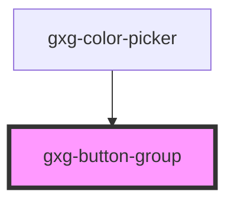

# gxg-button-group

<h2>Using a button group</h2>
<ol>
    <li>Insert a <code>gxg-button-group</code></li>
    <li>
        Add inside the <code>gxg-button-group</code>, as many <code>button</code>'s as you need.
    </li>
    <li>
     By default, the active <code>button</code> will the the first one. To make another <code>button</code> to be active by default, provide an <code>id</code> to that button, and set the same value to the <code>default-selected-btn-id</code> attribute on the <code>gxg-button-group</code> element
    </li>
    <li>
        Optionally, provide a <code>value</code> to each button, that will be reflected on the <code>gxg-button-group</code> <code>value</code> attribute with the value of the active button
    </li>
</ol>

<!-- Auto Generated Below -->

## Properties

| Property               | Attribute                 | Description                                                      | Type                            | Default     |
| ---------------------- | ------------------------- | ---------------------------------------------------------------- | ------------------------------- | ----------- |
| `buttonGroupTitle`     | `button-group-title`      | The button-group title                                           | `string`                        | `undefined` |
| `defaultSelectedBtnId` | `default-selected-btn-id` | The id of the button that you would like to be active by default | `string`                        | `undefined` |
| `disabled`             | `disabled`                | Wether the button group is disabled or not                       | `boolean`                       | `false`     |
| `fullWidth`            | `full-width`              | The presence of this attribute makes the component full-width    | `boolean`                       | `false`     |
| `titleAlignment`       | `title-alignment`         | The button group title alignment                                 | `"center" \| "left" \| "right"` | `"left"`    |

## Dependencies

### Used by

- [gxg-color-picker](../color-picker)

### Graph

---

_Built with [StencilJS](https://stenciljs.com/)_
