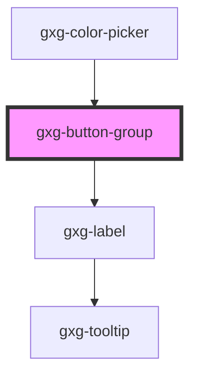

# gxg-button-group

<h2>Using a button group</h2>
<ol>
    <li>Insert a <code>gxg-button-group</code></li>
    <li>
        Append inside <code>gxg-button-group</code> as many <code>button</code>'s as you need.
    </li>
    <li>
     By default, the active <code>button</code> will the the first one. To make another <code>button</code> active by default, provide an <code>id</code> to that button, and set the same value to the <code>default-selected-btn-id</code> attribute on the <code>gxg-button-group</code>.
    </li>
    <li>
        Optionally, provide a <code>value</code> to each button, that will be reflected on the <code>gxg-button-group</code> <code>value</code> attribute, with the value of the actual active button.
    </li>
</ol>

<!-- Auto Generated Below -->

## Usage

### Usage

```
<gxg-button-group title-alignment="left" button-group-title="Buttons title"  default-selected-btn-id="button1">
    <button id="button1">Button 1</button>
    <button id="button2">Button 2</button>
    <button id="button3">Button 3</button>
</gxg-button-group>
```

## Properties

| Property               | Attribute                 | Description                                                                                                         | Type                           | Default     |
| ---------------------- | ------------------------- | ------------------------------------------------------------------------------------------------------------------- | ------------------------------ | ----------- |
| `activeButtonId`       | `active-button-id`        | The buttons style                                                                                                   | `string`                       | `undefined` |
| `buttonGroupTitle`     | `button-group-title`      | The button-group title                                                                                              | `string`                       | `undefined` |
| `defaultSelectedBtnId` | `default-selected-btn-id` | The id of the button that you would like to be active by default                                                    | `string`                       | `undefined` |
| `disableActive`        | `disable-active`          | The presence of this attribute disables the currently active button, meaning that it can not be pressed or clicked. | `boolean`                      | `false`     |
| `disabled`             | `disabled`                | Wether the button group is disabled or not                                                                          | `boolean`                      | `false`     |
| `fullWidth`            | `full-width`              | The presence of this attribute makes the component full-width                                                       | `boolean`                      | `false`     |
| `outlined`             | `outlined`                | The presence of this attribute makes the button group outlined                                                      | `boolean`                      | `false`     |
| `titleAlignment`       | `title-alignment`         | The button group title alignment                                                                                    | `"center" \| "end" \| "start"` | `"start"`   |
| `type`                 | `type`                    | The buttons style                                                                                                   | `"primary" \| "secondary"`     | `"primary"` |

## Dependencies

### Used by

- [gxg-color-picker](../color-picker)

### Depends on

- [gxg-label](../label)

### Graph



---

_Built with [StencilJS](https://stenciljs.com/)_
