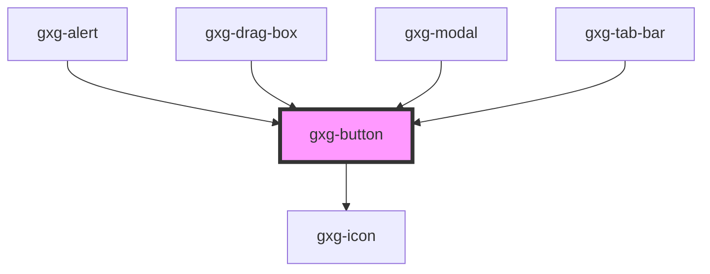

# gxg-button

<!-- Auto Generated Below -->

## Properties

| Property      | Attribute      | Description                                                   | Type                                                                                                                                                                                                                                                                                                                                                                                                                                                                                                                                                                       | Default               |
| ------------- | -------------- | ------------------------------------------------------------- | -------------------------------------------------------------------------------------------------------------------------------------------------------------------------------------------------------------------------------------------------------------------------------------------------------------------------------------------------------------------------------------------------------------------------------------------------------------------------------------------------------------------------------------------------------------------------- | --------------------- |
| `alwaysBlack` | `always-black` | The prescence of this attribute makes the icon always black   | `boolean`                                                                                                                                                                                                                                                                                                                                                                                                                                                                                                                                                                  | `false`               |
| `disabled`    | `disabled`     | The state of the button, whether it is disabled or not        | `boolean`                                                                                                                                                                                                                                                                                                                                                                                                                                                                                                                                                                  | `false`               |
| `fullWidth`   | `full-width`   | The presence of this attribute makes the component full-width | `boolean`                                                                                                                                                                                                                                                                                                                                                                                                                                                                                                                                                                  | `false`               |
| `icon`        | `icon`         | The button icon                                               | `"error" \| "success" \| "warning" \| "data-provider" \| "none" \| "add" \| "add-circle" \| "arrow-down" \| "arrow-left" \| "arrow-right" \| "arrow-up" \| "chevron-down" \| "chevron-left" \| "chevron-right" \| "chevron-up" \| "circle" \| "close" \| "color-picker" \| "deleted" \| "drag" \| "duplicate" \| "edit" \| "edit-wand" \| "empty" \| "file" \| "folder" \| "level-down" \| "level-up" \| "minus" \| "minus-circle" \| "notice" \| "pill-filled" \| "pill-outlined" \| "reset" \| "search" \| "settings" \| "show-more-horizontal" \| "show-more-vertical"` | `undefined`           |
| `negative`    | `negative`     | The prescence of this attribute turns the icon white          | `boolean`                                                                                                                                                                                                                                                                                                                                                                                                                                                                                                                                                                  | `false`               |
| `type`        | `type`         | The kind of button                                            | `"outlined" \| "primary-icon-only" \| "primary-text-icon" \| "primary-text-only" \| "secondary-icon-only" \| "secondary-text-icon" \| "secondary-text-only" \| "tertiary"`                                                                                                                                                                                                                                                                                                                                                                                                 | `"primary-text-only"` |

## Dependencies

### Used by

- [gxg-alert](../alert)
- [gxg-drag-box](../drag-box)
- [gxg-modal](../modal)
- [gxg-tab-bar](../tab-bar)

### Depends on

- [gxg-icon](../icon)

### Graph

---

_Built with [StencilJS](https://stenciljs.com/)_
