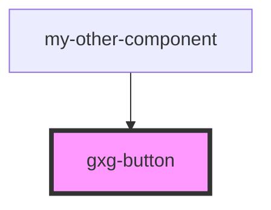

# Button

<!-- Auto Generated Below -->

## Properties

| Property   | Attribute  | Description                                                                       | Type      | Default     |
| ---------- | ---------- | --------------------------------------------------------------------------------- | --------- | ----------- |
| `disabled` | `disabled` | The state of the button. Whether is disabled or not. Possible values: false, true | `boolean` | `false`     |
| `type`     | `type`     | The kind of button Possible values: primary, secondary, text-only, icon-only      | `string`  | `'primary'` |

## Dependencies

### Used by

 - [my-other-component](..\my-other-component)

### Graph

----------------------------------------------

*Built with [StencilJS](https://stenciljs.com/)*
