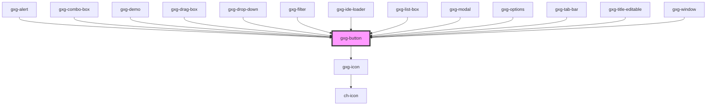

# gxg-button

<!-- Auto Generated Below -->

## Usage

### Usage

```
<gxg-button type="primary-text-only">Label</gxg-button>
<gxg-button type="primary-text-icon" icon="navigation/arrow-down">Label</gxg-button>
<gxg-button type="primary-text-icon" icon="controls/action-group">Label</gxg-button>
<gxg-button type="primary-text-icon" icon="gemini-tools/folder">Label</gxg-button>
<gxg-button type="primary-icon-only" icon="gemini-tools/folder">Label</gxg-button>
<gxg-button type="secondary-text-only" id="secondary-text-only">Label</gxg-button>
<gxg-button type="secondary-text-icon" icon="gemini-tools/folder">Label</gxg-button>
<gxg-button type="secondary-icon-only" icon="gemini-tools/folder"></gxg-button>
<gxg-button type="secondary-icon-only" icon="gemini-tools/edit"></gxg-button>
<gxg-button type="secondary-icon-only" icon="gemini-tools/duplicate"></gxg-button>
<gxg-button type="secondary-icon-only" icon="gemini-tools/delete"></gxg-button>
<gxg-button type="outlined">Label</gxg-button>
<gxg-button icon="navigation/arrow-down" type="tertiary"></gxg-button>
<gxg-button icon="controls/google-analytics" type="tertiary"></gxg-button>
<gxg-button class="button-with-action" icon="controls/table-column" type="tertiary"></gxg-button>
```

## Properties

| Property               | Attribute                | Description                                                                                                                              | Type                                                                                                                                                                                               | Default               |
| ---------------------- | ------------------------ | ---------------------------------------------------------------------------------------------------------------------------------------- | -------------------------------------------------------------------------------------------------------------------------------------------------------------------------------------------------- | --------------------- |
| `alwaysBlack`          | `always-black`           | The presence of this attribute makes the icon always black                                                                               | `boolean`                                                                                                                                                                                          | `false`               |
| `buttonStylesEditable` | `button-styles-editable` | The presence of this attribute lets the button styles be editable from outside of the component by referencing the "native-button" part. | `boolean`                                                                                                                                                                                          | `false`               |
| `disabled`             | `disabled`               | The state of the button, whether it is disabled or not                                                                                   | `boolean`                                                                                                                                                                                          | `false`               |
| `fit`                  | `fit`                    | The presence of this attribute will force the .native-button to be contained within the gxg-button host element                          | `boolean`                                                                                                                                                                                          | `false`               |
| `fullWidth`            | `full-width`             | The presence of this attribute makes the component full-width                                                                            | `boolean`                                                                                                                                                                                          | `false`               |
| `grabAttention`        | `grab-attention`         | The presence of this attribute with make the icon do a background color animation that will grab user attention                          | `boolean`                                                                                                                                                                                          | `false`               |
| `icon`                 | `icon`                   | The button icon                                                                                                                          | `any`                                                                                                                                                                                              | `undefined`           |
| `negative`             | `negative`               | The prescence of this attribute turns the icon white                                                                                     | `boolean`                                                                                                                                                                                          | `false`               |
| `type`                 | `type`                   | The kind of button                                                                                                                       | `"outlined" \| "outlined-text-icon" \| "primary-icon-only" \| "primary-text-icon" \| "primary-text-only" \| "secondary-icon-only" \| "secondary-text-icon" \| "secondary-text-only" \| "tertiary"` | `"primary-text-only"` |

## Shadow Parts

| Part     | Description |
| -------- | ----------- |
| `"icon"` |             |

## Dependencies

### Used by

- [gxg-alert](../alert)
- [gxg-combo-box](../combo-box)
- [gxg-demo](../demo)
- [gxg-drag-box](../drag-box)
- [gxg-drop-down](../drop-down)
- [gxg-filter](../filter)
- [gxg-ide-loader](../ide-loader)
- [gxg-list-box](../list-box)
- [gxg-modal](../modal)
- [gxg-options](../options)
- [gxg-tab-bar](../tab-bar)
- [gxg-title-editable](../title-editable)
- [gxg-window](../window)

### Depends on

- [gxg-icon](../icon)

### Graph



---

_Built with [StencilJS](https://stenciljs.com/)_
