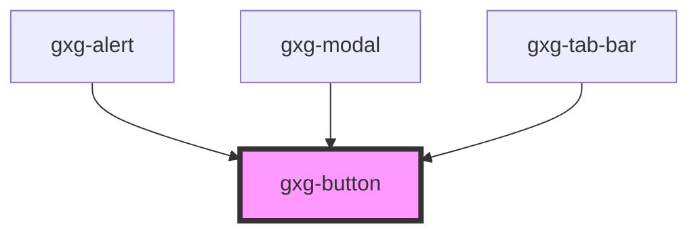

# gxg-button

<h2>Using a button</h2>
<ol>
    <li>Include the gx-button component: <code>&lt;gxg-button&gt;Button&lt;/gxg-button&gt;</code></li>
    <li>
        Set the type of button on the <em>type</em> property.
    </li>   
    <li>
        For the <em>icon</em> button types you will have to add an <em>icon component</em> as well, as part of the button content: 
        <code>&lt;gxg-icon slot=&quot;icon&quot; type=&quot;add&quot;&gt;&lt;/gxg-icon&gt;</code>.  <em>gxg-icon</em> component expects the <em>type</em> property, which is the name of the icon. Note that gxg-icon has a <em>slot</em> property set to "icon". This property/value ensures that the icon will be positioned at the left side of the button label.  To see the list of available icons check the <em>icon</em> component on the Storybook documentation. <strong>  note:</strong> When using an icon inside a <code>gxg-button</code> element, there is no need to set the icon <em>size</em> property, since the size will be set automatically by the button itself.
    </li>
</ol>
<!-- Auto Generated Below -->

## Properties

| Property   | Attribute  | Description                                          | Type                                                                                                                                                                       | Default               |
| ---------- | ---------- | ---------------------------------------------------- | -------------------------------------------------------------------------------------------------------------------------------------------------------------------------- | --------------------- |
| `disabled` | `disabled` | The state of the button. Whether is disabled or not. | `boolean`                                                                                                                                                                  | `false`               |
| `type`     | `type`     | The kind of button                                   | `"outlined" \| "primary-icon-only" \| "primary-text-icon" \| "primary-text-only" \| "secondary-icon-only" \| "secondary-text-icon" \| "secondary-text-only" \| "tertiary"` | `"primary-text-only"` |

## Dependencies

### Used by

- [gxg-alert](../alert)
- [gxg-modal](../modal)
- [gxg-tab-bar](../tab-bar)

### Graph

---

_Built with [StencilJS](https://stenciljs.com/)_
