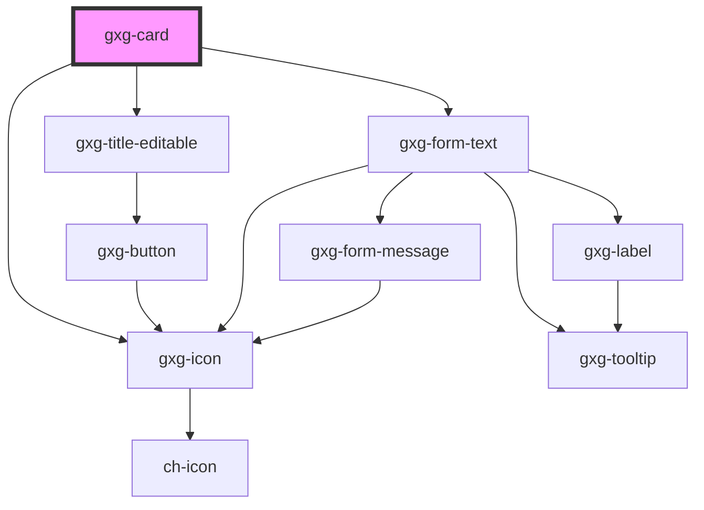

# gxg-box

## Properties

| Property     | Attribute    | Description                      | Type                                                          | Default   |
| ------------ | ------------ | -------------------------------- | ------------------------------------------------------------- | --------- |
| `background` | `background` | The background color             | `"gray-01" \| "gray-02" \| "white"`                           | `"white"` |
| `border`     | `border`     | Wether the box has border or not | `boolean`                                                     | `true`    |
| `maxWidth`   | `max-width`  | The component max. width         | `string`                                                      | `"100%"`  |
| `minHeight`  | `min-height` | The component min. height        | `string`                                                      | `"auto"`  |
| `padding`    | `padding`    | The box padding                  | `"0" \| "l" \| "m" \| "s" \| "xl" \| "xs" \| "xxl" \| "xxxl"` | `"xs"`    |

# gxg-card

<!-- Auto Generated Below -->

## Usage

### Usage

```
<gxg-box background="white" max-width="200px" padding="s">
    <q>Be who you are and say what you feel, because those who mind don’t matter, and those who matter don’t mind.– Bernard M. Baruch</q>
</gxg-box>

<gxg-card background="white" elevation="xs" max-width="200px" padding="s">
    <q>Be who you are and say what you feel, because those who mind don’t matter, and those who matter don’t mind.– Bernard M. Baruch</q>
</gxg-card>
```

## Properties

| Property        | Attribute        | Description                            | Type                                                          | Default     |
| --------------- | ---------------- | -------------------------------------- | ------------------------------------------------------------- | ----------- |
| `background`    | `background`     | The background color                   | `"gray-01" \| "white"`                                        | `"white"`   |
| `cardTitle`     | `card-title`     | An optional title                      | `string`                                                      | `undefined` |
| `cardType`      | `card-type`      | The card type (only for mercury)       | `"article" \| "section"`                                      | `"section"` |
| `editableTitle` | `editable-title` | It makes the title editable            | `boolean`                                                     | `false`     |
| `elevation`     | `elevation`      | The card box-shadow                    | `"m" \| "xs"`                                                 | `"xs"`      |
| `filter`        | `filter`         | filter search input (only for mercury) | `boolean`                                                     | `false`     |
| `height`        | `height`         | The component height                   | `string`                                                      | `"auto"`    |
| `icon`          | `icon`           | The card type (only for mercury)       | `string`                                                      | `undefined` |
| `maxWidth`      | `max-width`      | The component max. width               | `string`                                                      | `"100%"`    |
| `minHeight`     | `min-height`     | The component min. height              | `string`                                                      | `"auto"`    |
| `padding`       | `padding`        | The card padding                       | `"0" \| "l" \| "m" \| "s" \| "xl" \| "xs" \| "xxl" \| "xxxl"` | `"xs"`      |

## Dependencies

### Depends on

- [gxg-icon](../icon)
- [gxg-title-editable](../title-editable)
- [gxg-form-text](../form-text)

### Graph



---

_Built with [StencilJS](https://stenciljs.com/)_
