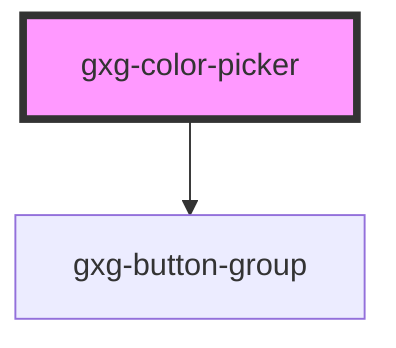

# dt-color-picker

<!-- Auto Generated Below -->

## Properties

| Property    | Attribute    | Description | Type     | Default   |
| ----------- | ------------ | ----------- | -------- | --------- |
| `cardTitle` | `card-title` |             | `string` | `""`      |
| `value`     | `value`      |             | `string` | `"white"` |

## Events

| Event            | Description | Type               |
| ---------------- | ----------- | ------------------ |
| `change`         |             | `CustomEvent<any>` |
| `nameInputEvent` |             | `CustomEvent<any>` |
| `save`           |             | `CustomEvent<any>` |

## Dependencies

### Depends on

- [gxg-button-group](../button-group)

### Graph

---

_Built with [StencilJS](https://stenciljs.com/)_
