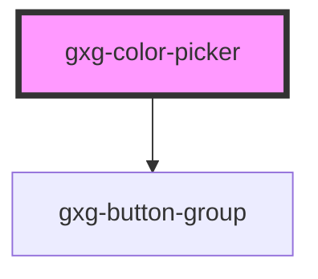

# gxg-color-picker

<!-- Auto Generated Below -->

## Properties

| Property | Attribute | Description                                                     | Type     | Default   |
| -------- | --------- | --------------------------------------------------------------- | -------- | --------- |
| `label`  | `label`   | The label of the color picker (optional)                        | `string` | `""`      |
| `value`  | `value`   | The color value, such as "red", #CCDDEE, or rgba(220,140,40,.5) | `string` | `"white"` |

## Events

| Event            | Description | Type               |
| ---------------- | ----------- | ------------------ |
| `change`         |             | `CustomEvent<any>` |
| `nameInputEvent` |             | `CustomEvent<any>` |
| `save`           |             | `CustomEvent<any>` |

## Dependencies

### Depends on

- [gxg-button-group](../button-group)

### Graph

---

_Built with [StencilJS](https://stenciljs.com/)_
