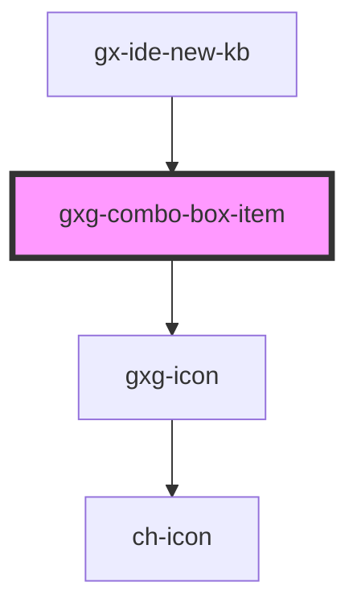

# gxg-combo-item

<!-- Auto Generated Below -->

## Properties

| Property    | Attribute    | Description                                                                                        | Type                                                                                                                                                                                     | Default     |
| ----------- | ------------ | -------------------------------------------------------------------------------------------------- | ---------------------------------------------------------------------------------------------------------------------------------------------------------------------------------------- | ----------- |
| `icon`      | `icon`       | Any icon that belongs to Gemini icon library: https://gx-gemini.netlify.app/?path=/story/icons     | `string`                                                                                                                                                                                 | `undefined` |
| `iconColor` | `icon-color` | (This prop is for internal use).                                                                   | `"alwaysblack" \| "auto" \| "disabled" \| "error" \| "negative" \| "onbackground" \| "ondisabled" \| "primary-active" \| "primary-enabled" \| "primary-hover" \| "success" \| "warning"` | `"auto"`    |
| `value`     | `value`      | The item value. If value is not provided, an automatic value will be generated with the innerText. | `any`                                                                                                                                                                                    | `undefined` |

## Events

| Event              | Description                                                                                                                                                                                               | Type               |
| ------------------ | --------------------------------------------------------------------------------------------------------------------------------------------------------------------------------------------------------- | ------------------ |
| `itemDidLoad`      |                                                                                                                                                                                                           | `CustomEvent<any>` |
| `itemSelected`     | This event is triggered when the user clicks on an item. event.detail contains the item index, item value, and item icon.                                                                                 | `CustomEvent<any>` |
| `keyDownComboItem` | This event is for internal use. This event is triggered when the user presses keyboard "arrow up" on the first item. This event is caputred on "combo" component and then focus is set on "search" input. | `CustomEvent<any>` |

## Dependencies

### Used by

- [gx-ide-new-kb](../gx-ide-new-kb)

### Depends on

- [gxg-icon](../icon)

### Graph

---

_Built with [StencilJS](https://stenciljs.com/)_
