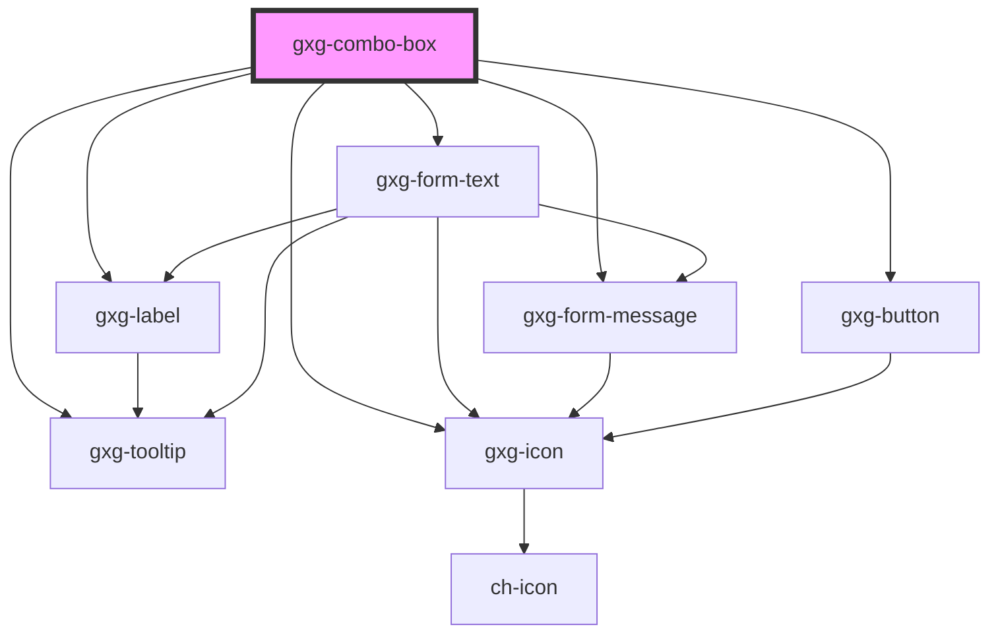

# gxg-combo-item

## Properties

| Property | Attribute | Description                                                                                                                      | Type     | Default     |
| -------- | --------- | -------------------------------------------------------------------------------------------------------------------------------- | -------- | ----------- |
| `icon`   | `icon`    | Any icon that belongs to Gemini icon library: https://gx-gemini.netlify.app/?path=/story/icons                                   | `string` | `undefined` |
| `value`  | `value`   | The item value. This is what the filter with search for. If value is not provided, the filter will search by the item innerText. | `string` | `undefined` |

## Events

| Event         | Description                                                                                                    | Type               |
| ------------- | -------------------------------------------------------------------------------------------------------------- | ------------------ |
| `itemClicked` | This event is triggered when the user clicks on an item. event.detail contains the item index, and item value. | `CustomEvent<any>` |

# gxg-combo-item

<!-- Auto Generated Below -->

## Properties

| Property             | Attribute             | Description                                                                                                                                                                                                                                                   | Type                                                   | Default           |
| -------------------- | --------------------- | ------------------------------------------------------------------------------------------------------------------------------------------------------------------------------------------------------------------------------------------------------------- | ------------------------------------------------------ | ----------------- |
| `caseSensitive`      | `case-sensitive`      | The presence of this attribute with make the filter search for values with case sensitive distinction                                                                                                                                                         | `boolean`                                              | `false`           |
| `centerLabel`        | `center-label`        | Centers the label                                                                                                                                                                                                                                             | `boolean`                                              | `false`           |
| `cursorEnd`          | `cursor-end`          | If true, it will position the cursor at the end when the input is focused.                                                                                                                                                                                    | `boolean`                                              | `false`           |
| `disableClear`       | `disable-clear`       | The presence of this attribute disables the clear button                                                                                                                                                                                                      | `boolean`                                              | `false`           |
| `disableFilter`      | `disable-filter`      | The presence of this attribute disables the filter                                                                                                                                                                                                            | `boolean`                                              | `false`           |
| `disabled`           | `disabled`            | The presence of this attribute makes the input disabled                                                                                                                                                                                                       | `boolean`                                              | `false`           |
| `fixedIcon`          | `fixed-icon`          | A fixed icon that will show on the combo, ignoring the combo-box-item's icons.                                                                                                                                                                                | `string`                                               | `undefined`       |
| `informationMessage` | `information-message` | An informative message to help the user filling the information                                                                                                                                                                                               | `string`                                               | `undefined`       |
| `label`              | `label`               | The combo label                                                                                                                                                                                                                                               | `string`                                               | `undefined`       |
| `labelPosition`      | `label-position`      | The input label                                                                                                                                                                                                                                               | `"above" \| "below" \| "end" \| "start"`               | `"above"`         |
| `labelWidth`         | `label-width`         | The label width                                                                                                                                                                                                                                               | `any`                                                  | `undefined`       |
| `listMaxHeight`      | `list-max-height`     | The combo list max height                                                                                                                                                                                                                                     | `string`                                               | `"244px"`         |
| `listPosition`       | `list-position`       | The container 'items container' position                                                                                                                                                                                                                      | `"above" \| "below"`                                   | `"below"`         |
| `maxWidth`           | `max-width`           | The combo max-width                                                                                                                                                                                                                                           | `string`                                               | `"100%"`          |
| `minWidth`           | `min-width`           | The combo min-width                                                                                                                                                                                                                                           | `string`                                               | `"0"`             |
| `placeholder`        | `placeholder`         | The combo placeholder                                                                                                                                                                                                                                         | `string`                                               | `"Search item"`   |
| `required`           | `required`            | The presence of this attribute makes the commbo required                                                                                                                                                                                                      | `boolean`                                              | `false`           |
| `strict`             | `strict`              | If this attribute is present, "value" will only return something if a comboItem is selected, otherwise it will return undefined. if this attribute is not present, "value" will return the value of the actual comboItem, or whatever text the comboItem has. | `boolean`                                              | `false`           |
| `toolTip`            | `tool-tip`            | The presence of this attribute displays a tooltip message, instead of a block message below the control                                                                                                                                                       | `boolean`                                              | `false`           |
| `validationMessage`  | `validation-message`  | The message to display when validation fails (error)                                                                                                                                                                                                          | `string`                                               | `undefined`       |
| `validationStatus`   | `validation-status`   | The validation status                                                                                                                                                                                                                                         | `"error" \| "indeterminate" \| "success" \| "warning"` | `"indeterminate"` |
| `value`              | `value`               | The current combo box item value                                                                                                                                                                                                                              | `any`                                                  | `undefined`       |

## Events

| Event          | Description                                                                 | Type                   |
| -------------- | --------------------------------------------------------------------------- | ---------------------- |
| `closed`       | This event is triggered when the combo dropdown has closed                  | `CustomEvent<any>`     |
| `opened`       | This event is triggered when the combo dropdown is opened                   | `CustomEvent<any>`     |
| `toggled`      | This event is triggered when the combo dropdown has toggled (opened/closed) | `CustomEvent<boolean>` |
| `valueChanged` | This event is triggered when the combo box value changes.                   | `CustomEvent<any>`     |

## Methods

### `close() => Promise<void>`

closes the combo

#### Returns

Type: `Promise<void>`

### `getValueByIndex(index: number) => Promise<string>`

#### Returns

Type: `Promise<string>`

### `open() => Promise<void>`

---

METHODS

---

#### Returns

Type: `Promise<void>`

### `selectInputText() => Promise<void>`

#### Returns

Type: `Promise<void>`

### `setValueByIndex(index: number) => Promise<boolean>`

#### Returns

Type: `Promise<boolean>`

## Dependencies

### Depends on

- [gxg-label](../label)
- [gxg-form-text](../form-text)
- [gxg-button](../button)
- [gxg-form-message](../form-message)
- [gxg-tooltip](../tooltip)
- [gxg-icon](../icon)

### Graph

---

_Built with [StencilJS](https://stenciljs.com/)_
