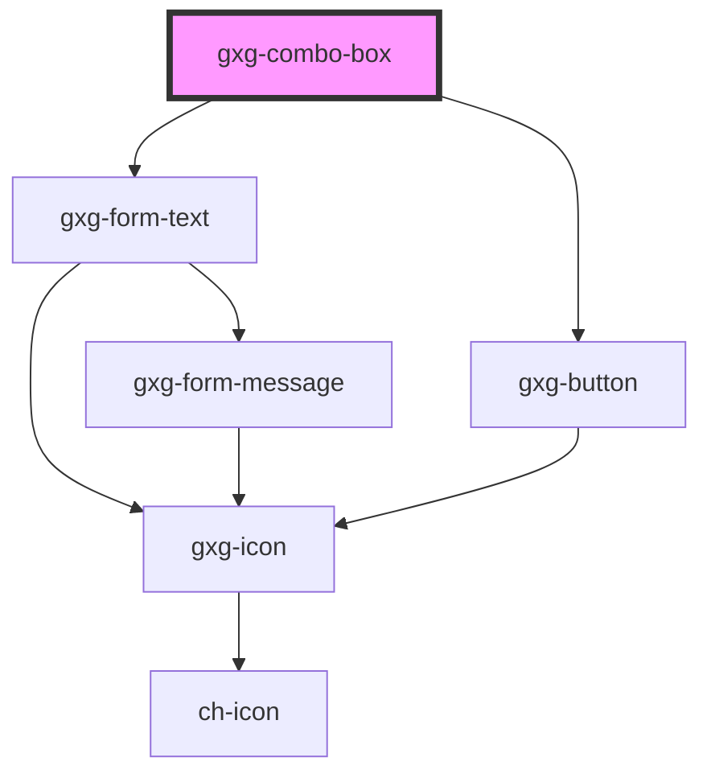

# gxg-combo-item

## Properties

| Property | Attribute | Description                                                                                                                      | Type     | Default     |
| -------- | --------- | -------------------------------------------------------------------------------------------------------------------------------- | -------- | ----------- |
| `icon`   | `icon`    | Any icon that belongs to Gemini icon library: https://gx-gemini.netlify.app/?path=/story/icons                                   | `string` | `undefined` |
| `value`  | `value`   | The item value. This is what the filter with search for. If value is not provided, the filter will search by the item innerText. | `string` | `undefined` |

## Events

| Event         | Description                                                                                                    | Type               |
| ------------- | -------------------------------------------------------------------------------------------------------------- | ------------------ |
| `itemClicked` | This event is triggered when the user clicks on an item. event.detail contains the item index, and item value. | `CustomEvent<any>` |

# gxg-combo-item

<!-- Auto Generated Below -->

## Properties

| Property        | Attribute        | Description                                                                                                                                                                                                                                                   | Type                | Default         |
| --------------- | ---------------- | ------------------------------------------------------------------------------------------------------------------------------------------------------------------------------------------------------------------------------------------------------------- | ------------------- | --------------- |
| `disableClear`  | `disable-clear`  | The presence of this attribute disables the clear button                                                                                                                                                                                                      | `boolean`           | `false`         |
| `disableFilter` | `disable-filter` | The presence of this attribute disables the filter                                                                                                                                                                                                            | `boolean`           | `false`         |
| `isOpen`        | `is-open`        | This property returns true if the combo-box list is open, false otherwise. Do not use this property to open or close the combo-box list, for that purpose use the open() or close() methods.                                                                  | `boolean`           | `false`         |
| `maxWidth`      | `max-width`      | The combo max-width                                                                                                                                                                                                                                           | `string`            | `"none"`        |
| `minWidth`      | `min-width`      | The combo min-width                                                                                                                                                                                                                                           | `string`            | `"0"`           |
| `placeholder`   | `placeholder`    | The combo placeholder                                                                                                                                                                                                                                         | `string`            | `"Search item"` |
| `position`      | `position`       | The container 'items container' position                                                                                                                                                                                                                      | `"bottom" \| "top"` | `"bottom"`      |
| `strict`        | `strict`         | If this attribute is present, "value" will only return something if a comboItem is selected, otherwise it will return undefined. if this attribute is not present, "value" will return the value of the actual comboItem, or whatever text the comboItem has. | `boolean`           | `false`         |
| `value`         | `value`          | Get or set the selected item value                                                                                                                                                                                                                            | `any`               | `undefined`     |
| `width`         | `width`          | The combo width                                                                                                                                                                                                                                               | `string`            | `"240px"`       |

## Events

| Event     | Description | Type                  |
| --------- | ----------- | --------------------- |
| `keyDown` |             | `CustomEvent<string>` |

## Methods

### `close() => Promise<void>`

#### Returns

Type: `Promise<void>`

### `getValueByIndex(index: number) => Promise<string>`

#### Returns

Type: `Promise<string>`

### `open() => Promise<void>`

#### Returns

Type: `Promise<void>`

### `setValueByIndex(index: number) => Promise<void>`

#### Returns

Type: `Promise<void>`

## Dependencies

### Depends on

- [gxg-form-text](../form-text)
- [gxg-button](../button)

### Graph

---

_Built with [StencilJS](https://stenciljs.com/)_
