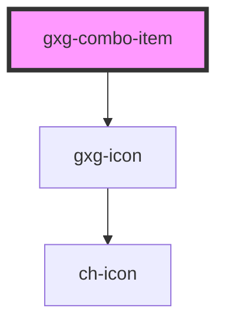

# gxg-combo-item

<!-- Auto Generated Below -->

## Properties

| Property | Attribute | Description                                                                                                                      | Type     | Default     |
| -------- | --------- | -------------------------------------------------------------------------------------------------------------------------------- | -------- | ----------- |
| `icon`   | `icon`    | Any icon that belongs to Gemini icon library: https://gx-gemini.netlify.app/?path=/story/icons                                   | `string` | `undefined` |
| `value`  | `value`   | The item value. This is what the filter with search for. If value is not provided, the filter will search by the item innerHTML. | `any`    | `undefined` |

## Events

| Event         | Description                                                                                                               | Type               |
| ------------- | ------------------------------------------------------------------------------------------------------------------------- | ------------------ |
| `itemClicked` | This event is triggered when the user clicks on an item. event.detail contains the item index, item value, and item icon. | `CustomEvent<any>` |

## Dependencies

### Depends on

- [gxg-icon](../icon)

### Graph

---

_Built with [StencilJS](https://stenciljs.com/)_
