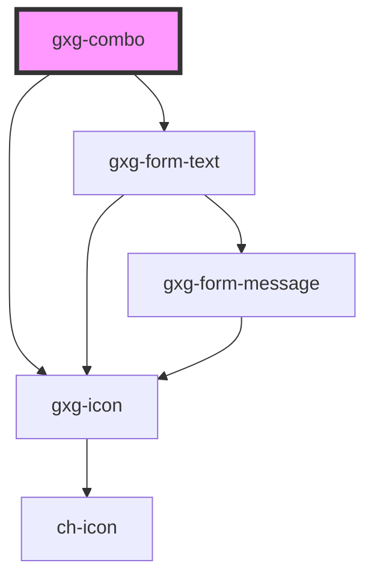

# gxg-combo

<!-- Auto Generated Below -->

## Properties

| Property | Attribute | Description | Type       | Default     |
| -------- | --------- | ----------- | ---------- | ----------- |
| `items`  | --        |             | `object[]` | `undefined` |
| `width`  | `width`   |             | `string`   | `"240px"`   |

## Events

| Event         | Description                                                                                                    | Type               |
| ------------- | -------------------------------------------------------------------------------------------------------------- | ------------------ |
| `itemClicked` | This event is triggered when the user clicks on an item. event.detail contains the item index, and item value. | `CustomEvent<any>` |

## Dependencies

### Depends on

- [gxg-form-text](../form-text)
- [gxg-icon](../icon)

### Graph

---

_Built with [StencilJS](https://stenciljs.com/)_
