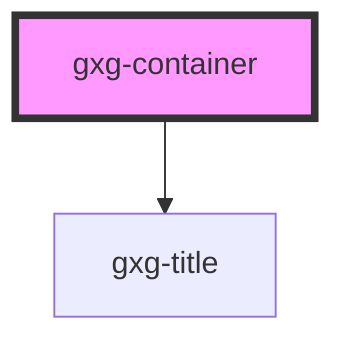

# gxg-group

<!-- Auto Generated Below -->

## Properties

| Property              | Attribute               | Description                                                                | Type                           | Default     |
| --------------------- | ----------------------- | -------------------------------------------------------------------------- | ------------------------------ | ----------- |
| `containerTitle`      | `container-title`       | The title of the container                                                 | `string`                       | `undefined` |
| `displayBorder`       | `display-border`        | Dsiplays a border all around the container                                 | `boolean`                      | `false`     |
| `displayBorderBottom` | `display-border-bottom` | Removes the component border on the bottom                                 | `boolean`                      | `false`     |
| `displayBorderEnd`    | `display-border-end`    | Removes the component border on the end                                    | `boolean`                      | `false`     |
| `displayBorderStart`  | `display-border-start`  | Removes the component border on the start                                  | `boolean`                      | `false`     |
| `displayBorderTop`    | `display-border-top`    | Removes the component border on the top                                    | `boolean`                      | `false`     |
| `fieldset`            | `fieldset`              | Makes this component content act as a fieldset                             | `boolean`                      | `false`     |
| `footerJustify`       | `footer-justify`        | The footer justification                                                   | `"center" \| "end" \| "start"` | `"end"`     |
| `headingJustify`      | `heading-justify`       | The heading justification                                                  | `"center" \| "end" \| "start"` | `"center"`  |
| `noBorderFooter`      | `no-border-footer`      | Removes the border top from the footer                                     | `boolean`                      | `false`     |
| `noContentGap`        | `no-content-gap`        | Removes the gap from the content                                           | `boolean`                      | `false`     |
| `noContentPadding`    | `no-content-padding`    | Removes the padding from the content                                       | `boolean`                      | `false`     |
| `noFooterPadding`     | `no-footer-padding`     | Removes the padding from the footer                                        | `boolean`                      | `false`     |
| `noHeadingBorder`     | `no-heading-border`     | Removes the border bottom from the heading                                 | `boolean`                      | `false`     |
| `noHeadingPadding`    | `no-heading-padding`    | Removes the padding from the heading                                       | `boolean`                      | `false`     |
| `sectionsPadding`     | `sections-padding`      | The container general padding (applies to .heading, .content, and .footer) | `"l" \| "m" \| "s"`            | `"m"`       |

## Dependencies

### Depends on

- [gxg-title](../title)

### Graph

----------------------------------------------

*Built with [StencilJS](https://stenciljs.com/)*
