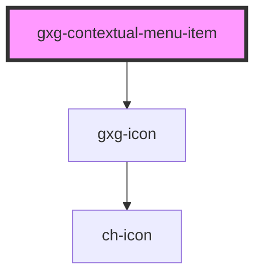

# gxg-contextual-menu-item

<!-- Auto Generated Below -->

## Properties

| Property | Attribute | Description   | Type     | Default     |
| -------- | --------- | ------------- | -------- | ----------- |
| `icon`   | `icon`    | Optional icon | `string` | `null`      |
| `id`     | `id`      | The id        | `string` | `undefined` |

## Events

| Event                        | Description | Type                  |
| ---------------------------- | ----------- | --------------------- |
| `contextualMenuItemSelected` |             | `CustomEvent<string>` |

## Dependencies

### Depends on

- [gxg-icon](../icon)

### Graph

---

_Built with [StencilJS](https://stenciljs.com/)_
