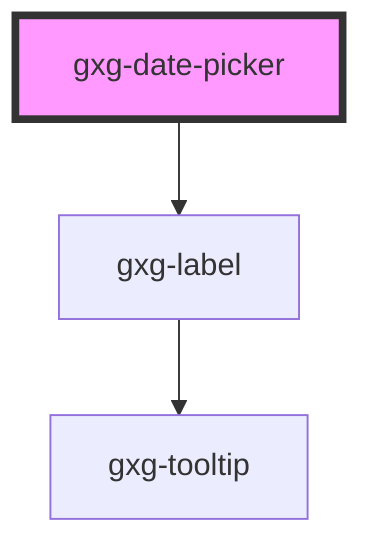

# gxg-date-picker

<h2>Notes</h2>
<ul>
   <li>gxg-date-picker expects a <code>min-date</code> and a <code>max-date</code> attributes to work.</li>
</ul>

<!-- Auto Generated Below -->

## Usage

### Usage

```
<gxg-date-picker
default-date="2020, 12, 20"
label="Set your birthday:"
max-width="240px"
max-date="2023, 12, 20"
min-date="2019, 12, 20"
no-weekends>
</gxg-date-picker>
```

## Properties

| Property     | Attribute     | Description                                                         | Type             | Default     |
| ------------ | ------------- | ------------------------------------------------------------------- | ---------------- | ----------- |
| `alwaysShow` | `always-show` | The presence of this attribute makes the date-picker always visible | `boolean`        | `false`     |
| `disabled`   | `disabled`    | It disabled the date-picker                                         | `boolean`        | `false`     |
| `label`      | `label`       | The datepicker label                                                | `string`         | `undefined` |
| `maxDate`    | `max-date`    | The max. date                                                       | `Date \| string` | `undefined` |
| `maxWidth`   | `max-width`   | The max. width                                                      | `string`         | `"100%"`    |
| `minDate`    | `min-date`    | The min. date                                                       | `Date \| string` | `undefined` |
| `noWeekends` | `no-weekends` | no weekends available                                               | `boolean`        | `false`     |
| `value`      | `value`       | initial date                                                        | `Date \| string` | `undefined` |

## Events

| Event          | Description                 | Type                          |
| -------------- | --------------------------- | ----------------------------- |
| `valueChanged` | Emits the new selected date | `CustomEvent<Date \| string>` |

## Dependencies

### Depends on

- [gxg-label](../label)

### Graph



---

_Built with [StencilJS](https://stenciljs.com/)_
