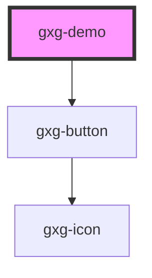

# gxg-test

<!-- Auto Generated Below -->

## Properties

| Property       | Attribute       | Description | Type      | Default                  |
| -------------- | --------------- | ----------- | --------- | ------------------------ |
| `initiateDemo` | `initiate-demo` |             | `boolean` | `false`                  |
| `layerZIndex`  | `layer-z-index` |             | `number`  | `100`                    |
| `modalMessage` | `modal-message` |             | `string`  | `"Welcome to the demo!"` |

## Dependencies

### Depends on

- [gxg-button](../button)

### Graph

---

_Built with [StencilJS](https://stenciljs.com/)_
