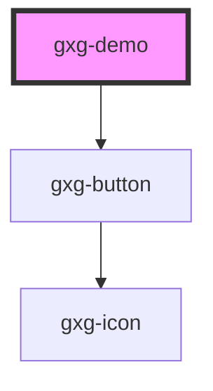

# gxg-demo

<h2>Instructions</h2>

For each item:

<ol>
   <li>Add the attribute <code>gxg-demo-item</code></li>
   <li>Set the message instruction position by passing a value to the <code>instruction-position</code> attribute. Possible values: <code>bottom-left</code>, <code>bottom-center</code>, <code>bottom-right</code>, <code>top-left</code>,  <code>top-center</code>, or <code>top-right</code>. When the instruction-position is "bottom-", the instruction will appear <em>under</em> the item. When the instruction-position is "top-", the instruction will appear <em>above</em> the item.</li>
   <li>Finally, set the instruction message, by passing the text to the <code>instruction-message</code> attribute.</li>
</ol>

<h2>Notes</h2>
<ul>
  <li>You can set the message for the navigation modal, by passing the desired text to the <code>modal-message</code> attrubte on the <code>gxg-demo</code> component.</li>
  <li>To fire the demo, set the <code>initiate-demo</code> atribute to "true" on the <code>gxg-demo</code> component.</li>
  <li>By default, the demo layer z-index is set to "100". You can change this value by passing the desired z-index value to the <code>layer-z-index</code> attribute on the <code>gxg-demo</code> component.</li>
</ul>
<!-- Auto Generated Below -->

## Properties

| Property       | Attribute       | Description | Type      | Default                  |
| -------------- | --------------- | ----------- | --------- | ------------------------ |
| `initiateDemo` | `initiate-demo` |             | `boolean` | `false`                  |
| `layerZIndex`  | `layer-z-index` |             | `number`  | `100`                    |
| `modalMessage` | `modal-message` |             | `string`  | `"Welcome to the demo!"` |

## Dependencies

### Depends on

- [gxg-button](../button)

### Graph

---

_Built with [StencilJS](https://stenciljs.com/)_
