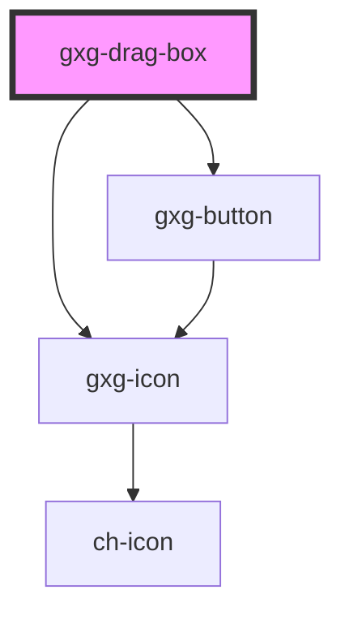

# gxg-drag-container

<h2>Notes</h2>
<ul>
   <li>To make the boxes draggable, wrap any number of <code>gxg-drag-box</code>'s inside an <code>gxg-drag-container</code>.</li>
   <li>Add the "deletable" atribute on the <code>drag-container</code> to add a "delete" button to all of the draggable boxes.</li>
   <li>When "delete" button is pressed, the "deleted" event is emitted. It is the responsability of the developer to listen to this event and remove the <code>gxg-drag-box</code>.</li>
   <li>To apply the same padding to all the boxes, add the desired padding to the <code>gxg-drag-container</code>.</li>
</ul>

## Properties

| Property    | Attribute   | Description                                                                                                               | Type                                                          | Default     |
| ----------- | ----------- | ------------------------------------------------------------------------------------------------------------------------- | ------------------------------------------------------------- | ----------- |
| `deletable` | `deletable` | The presence of this attribute adds a "delete" button to each gxg-drag-box. When pressed, the "deleted" event is emmited. | `boolean`                                                     | `false`     |
| `maxWidth`  | `max-width` | The max-width of the box container                                                                                        | `string`                                                      | `"100%"`    |
| `padding`   | `padding`   | The padding (internal spacing) of the gxg-drag-boxes                                                                      | `"0" \| "l" \| "m" \| "s" \| "xl" \| "xs" \| "xxl" \| "xxxl"` | `undefined` |

# gxg-drag-box

<!-- Auto Generated Below -->

## Properties

| Property    | Attribute   | Description                                                                                                                              | Type                                                          | Default     |
| ----------- | ----------- | ---------------------------------------------------------------------------------------------------------------------------------------- | ------------------------------------------------------------- | ----------- |
| `active`    | `active`    | The presence of this attribute makes this box active                                                                                     | `boolean`                                                     | `false`     |
| `deletable` | `deletable` | The presence of this attribute adds a "delete" button that, when pressed, triggers the "deleted" event                                   | `boolean`                                                     | `false`     |
| `padding`   | `padding`   | The padding (internal spacing) of the drag-box (Set it on the drag-container to apply the same padding to all of the gxg-drag-box items) | `"0" \| "l" \| "m" \| "s" \| "xl" \| "xs" \| "xxl" \| "xxxl"` | `"s"`       |
| `title`     | `title`     | The title                                                                                                                                | `string`                                                      | `undefined` |

## Events

| Event     | Description                                          | Type               |
| --------- | ---------------------------------------------------- | ------------------ |
| `clicked` | This event is for internal use                       | `CustomEvent<any>` |
| `deleted` | This event fires when the "delete" button is pressed | `CustomEvent<any>` |

## Dependencies

### Depends on

- [gxg-icon](../icon)
- [gxg-button](../button)

### Graph

---

_Built with [StencilJS](https://stenciljs.com/)_
