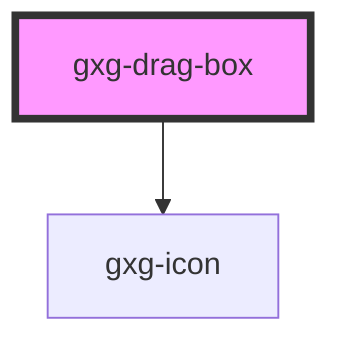

# gxg-drag-container

<h2>Notes</h2>
<ul>
   <li>To make the boxes draggable, wrap any number of <code>gxg-drag-box</code>'s inside an <code>gxg-drag-container</code></li>
</ul>

## Properties

| Property   | Attribute   | Description                        | Type     | Default  |
| ---------- | ----------- | ---------------------------------- | -------- | -------- |
| `maxWidth` | `max-width` | The max-width of the box container | `string` | `"100%"` |

# gxg-drag-box

<!-- Auto Generated Below -->

## Properties

| Property  | Attribute | Description                    | Type                                                   | Default     |
| --------- | --------- | ------------------------------ | ------------------------------------------------------ | ----------- |
| `padding` | `padding` | The padding (internal spacing) | `"l" \| "m" \| "s" \| "xl" \| "xs" \| "xxl" \| "xxxl"` | `undefined` |

## Dependencies

### Depends on

- [gxg-icon](../icon)

### Graph

---

_Built with [StencilJS](https://stenciljs.com/)_
