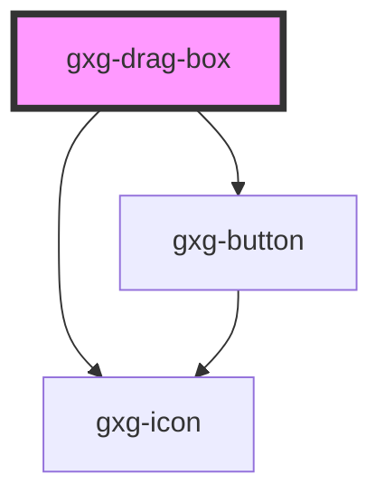

# gxg-drag-container

<h2>Notes</h2>
<ul>
   <li>To make the boxes draggable, wrap any number of <code>gxg-drag-box</code>'s inside an <code>gxg-drag-container</code></li>
   <li>Add the "deletable" atribute on the <code>drag-container</code> to add a "delete" button to all of the draggable boxes</li>
</ul>

## Properties

| Property    | Attribute   | Description                                                                                                | Type                                                   | Default     |
| ----------- | ----------- | ---------------------------------------------------------------------------------------------------------- | ------------------------------------------------------ | ----------- |
| `deletable` | `deletable` | The presence of this attribute adds a "delete" button to each child, that you can press to delete the item | `boolean`                                              | `false`     |
| `maxWidth`  | `max-width` | The max-width of the box container                                                                         | `string`                                               | `"100%"`    |
| `padding`   | `padding`   |                                                                                                            | `"l" \| "m" \| "s" \| "xl" \| "xs" \| "xxl" \| "xxxl"` | `undefined` |

# gxg-drag-box

<h2>Notes</h2>
<ul>
   <li>When the "delete" button is pressed, the "deleted" event is emmited. The drag-box will not be automatically removed from the dom. It is the responsibility of the developer to remove it.</li>
</ul>

<!-- Auto Generated Below -->

## Properties

| Property    | Attribute   | Description                                                                                | Type                                                          | Default     |
| ----------- | ----------- | ------------------------------------------------------------------------------------------ | ------------------------------------------------------------- | ----------- |
| `active`    | `active`    | The presence of this attribute makes this box active                                       | `boolean`                                                     | `false`     |
| `deletable` | `deletable` | The presence of this attribute adds a "delete" button that you can press to delete the box | `boolean`                                                     | `false`     |
| `padding`   | `padding`   | The padding (internal spacing)                                                             | `"0" \| "l" \| "m" \| "s" \| "xl" \| "xs" \| "xxl" \| "xxxl"` | `undefined` |
| `title`     | `title`     | The title                                                                                  | `string`                                                      | `undefined` |

## Events

| Event     | Description                                          | Type               |
| --------- | ---------------------------------------------------- | ------------------ |
| `clicked` | This event is for internal use                       | `CustomEvent<any>` |
| `deleted` | This event fires when the "delete" button is pressed | `CustomEvent<any>` |

## Dependencies

### Depends on

- [gxg-icon](../icon)
- [gxg-button](../button)

### Graph

---

_Built with [StencilJS](https://stenciljs.com/)_
