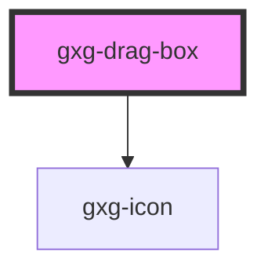

# gxg-template

<!-- Auto Generated Below -->

## Properties

| Property   | Attribute   | Description                                                                       | Type     | Default     |
| ---------- | ----------- | --------------------------------------------------------------------------------- | -------- | ----------- |
| `maxWidth` | `max-width` | The state of the toggle. Whether is disabled or not. Possible values: false, true | `string` | `undefined` |

## Dependencies

### Depends on

- [gxg-icon](../icon)

### Graph

---

_Built with [StencilJS](https://stenciljs.com/)_
