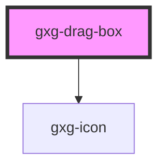

<h2>Notes</h2>
<ul>
   <li>To make the boxes draggable, wrap any number of <code>gxg-drag-box</code>'s inside an <code>gxg-drag-container</code> component</li>
</ul>

# gxg-drag-container

## Properties

| Property    | Attribute    | Description                                                   | Type      | Default   |
| ----------- | ------------ | ------------------------------------------------------------- | --------- | --------- |
| `fullWidth` | `full-width` | The presence of this attribute makes the component full-width | `boolean` | `false`   |
| `maxWidth`  | `max-width`  | The max-width of the box container                            | `string`  | `"200px"` |

# gxg-drag-box

(no properties)

<!-- Auto Generated Below -->

## Dependencies

### Depends on

- [gxg-icon](../icon)

### Graph

---

_Built with [StencilJS](https://stenciljs.com/)_
