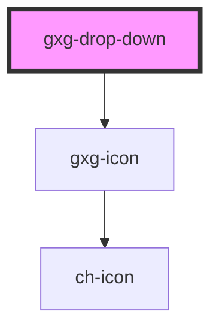

# gxg-drop-down

<h2>Notes</h2>
<ul>
  <li>The button content is passed as slotted content, with slot attribute value equal to "button". Example: <code>&lt;span&gt; slot="button">The button custom content&lt;/span&gt;</code>. If no "button" sloted content is passed "Select item" text will apear on the drop-down button</li>
</ul>

<!-- Auto Generated Below -->

## Properties

| Property    | Attribute    | Description                                                                                                                                                                                  | Type      | Default   |
| ----------- | ------------ | -------------------------------------------------------------------------------------------------------------------------------------------------------------------------------------------- | --------- | --------- |
| `icon`      | `icon`       | the dropdown icon (optional)                                                                                                                                                                 | `string`  | `""`      |
| `isOpen`    | `is-open`    | This property returns true if the drop-down list is open, false otherwise. Do not use this property to open or close the drop-down list, for that purpose use the open() or close() methods. | `boolean` | `false`   |
| `label`     | `label`      | the dropdown label (optional)                                                                                                                                                                | `string`  | `""`      |
| `maxHeight` | `max-height` | the dropdown max. height                                                                                                                                                                     | `string`  | `"120px"` |
| `width`     | `width`      | the dropdown width                                                                                                                                                                           | `string`  | `"240px"` |

## Events

| Event    | Description                                        | Type               |
| -------- | -------------------------------------------------- | ------------------ |
| `closed` | This events gets fired when the dropdown is closed | `CustomEvent<any>` |
| `opened` | This events gets fired when the dropdown is opened | `CustomEvent<any>` |

## Dependencies

### Depends on

- [gxg-icon](../icon)

### Graph

---

_Built with [StencilJS](https://stenciljs.com/)_
