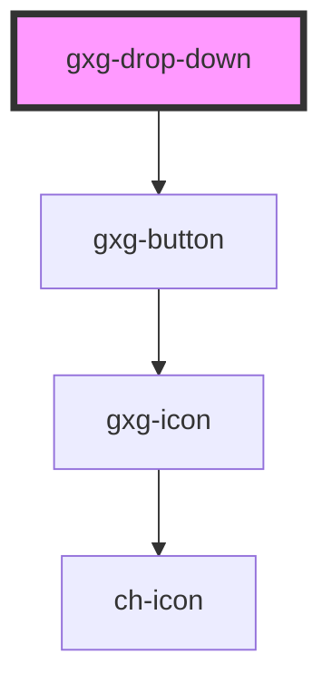

# gxg-drop-down

<!-- Auto Generated Below -->

## Properties

| Property      | Attribute      | Description               | Type      | Default   |
| ------------- | -------------- | ------------------------- | --------- | --------- |
| `maxHeight`   | `max-height`   | the component max. height | `string`  | `"120px"` |
| `showContent` | `show-content` | Displayes the content     | `boolean` | `false`   |
| `width`       | `width`        | the component width       | `string`  | `"240px"` |

## Dependencies

### Depends on

- [gxg-button](../button)

### Graph

---

_Built with [StencilJS](https://stenciljs.com/)_
