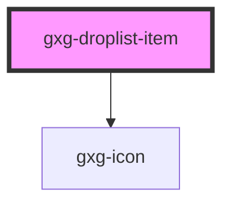

# gxg-template

<!-- Auto Generated Below -->

## Properties

| Property   | Attribute  | Description                                                                       | Type      | Default   |
| ---------- | ---------- | --------------------------------------------------------------------------------- | --------- | --------- |
| `disabled` | `disabled` | The state of the toggle. Whether is disabled or not. Possible values: false, true | `boolean` | `false`   |
| `label`    | `label`    | The toggle label                                                                  | `string`  | `"Label"` |

## Dependencies

### Depends on

- [gxg-icon](../icon)

### Graph

---

_Built with [StencilJS](https://stenciljs.com/)_
