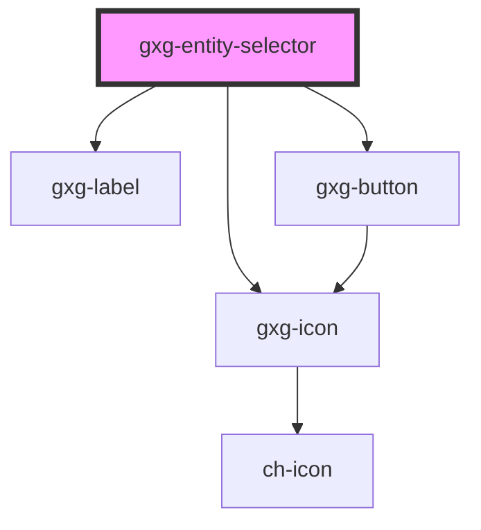

# gxg-entity-selector

<!-- Auto Generated Below -->

## Properties

| Property              | Attribute        | Description                                                                                                             | Type                                                             | Default                                                                                               |
| --------------------- | ---------------- | ----------------------------------------------------------------------------------------------------------------------- | ---------------------------------------------------------------- | ----------------------------------------------------------------------------------------------------- |
| `accessibilityLabels` | --               | This property provides the user a way to define custom aria-label descriptions.                                         | `{ buttonClearLabel: string; buttonSelectLabel: string; }`       | `{ buttonClearLabel: "clears the actual value", buttonSelectLabel: "displays the entity selector", }` |
| `centerLabel`         | `center-label`   | Centers the label                                                                                                       | `boolean`                                                        | `false`                                                                                               |
| `defaultValue`        | --               | Default value to be assigned as the component's value. This value should always be used when the 'X' button is pressed. | `{ id: string; name: string; iconSrc?: string; color?: Color; }` | `undefined`                                                                                           |
| `label`               | `label`          | Optional label (same as the label of an input).                                                                         | `string`                                                         | `undefined`                                                                                           |
| `labelPosition`       | `label-position` | The label position                                                                                                      | `"above" \| "start"`                                             | `"above"`                                                                                             |
| `labelWidth`          | `label-width`    | The label width                                                                                                         | `any`                                                            | `undefined`                                                                                           |
| `onSelectEntity`      | --               | Callback that will be called when the user presses the action button. Returns the new value assigned to the component.  | `() => Promise<EntityData>`                                      | `undefined`                                                                                           |
| `value`               | --               | Value currently assigned.                                                                                               | `{ id: string; name: string; iconSrc?: string; color?: Color; }` | `undefined`                                                                                           |

## Shadow Parts

| Part              | Description |
| ----------------- | ----------- |
| `"button"`        |             |
| `"button-clear"`  |             |
| `"button-select"` |             |
| `"icon"`          |             |
| `"input"`         |             |
| `"input-entity"`  |             |
| `"label"`         |             |
| `"wrapper"`       |             |

## Dependencies

### Depends on

- [gxg-label](../label)
- [gxg-icon](../icon)
- [gxg-button](../button)

### Graph

---

_Built with [StencilJS](https://stenciljs.com/)_
