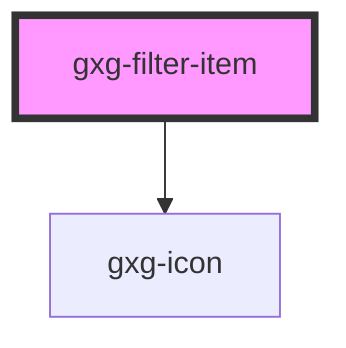

# gxg-filter-item

<!-- Auto Generated Below -->

## Properties

| Property | Attribute | Description                                                                                    | Type     | Default     |
| -------- | --------- | ---------------------------------------------------------------------------------------------- | -------- | ----------- |
| `icon`   | `icon`    | Any icon that belongs to Gemini icon library: https://gx-gemini.netlify.app/?path=/story/icons | `string` | `undefined` |
| `itemId` | `item-id` | The item-id (required if you want to know that this item was clicked)                          | `any`    | `undefined` |
| `type`   | `type`    | The type (optional)                                                                            | `any`    | `undefined` |

## Events

| Event              | Description                                                                                            | Type               |
| ------------------ | ------------------------------------------------------------------------------------------------------ | ------------------ |
| `itemClickedEvent` | This event is fired when the user clicks on an item. event.detail carries the item id, type, and text. | `CustomEvent<any>` |

## Dependencies

### Depends on

- [gxg-icon](../icon)

### Graph

---

_Built with [StencilJS](https://stenciljs.com/)_
