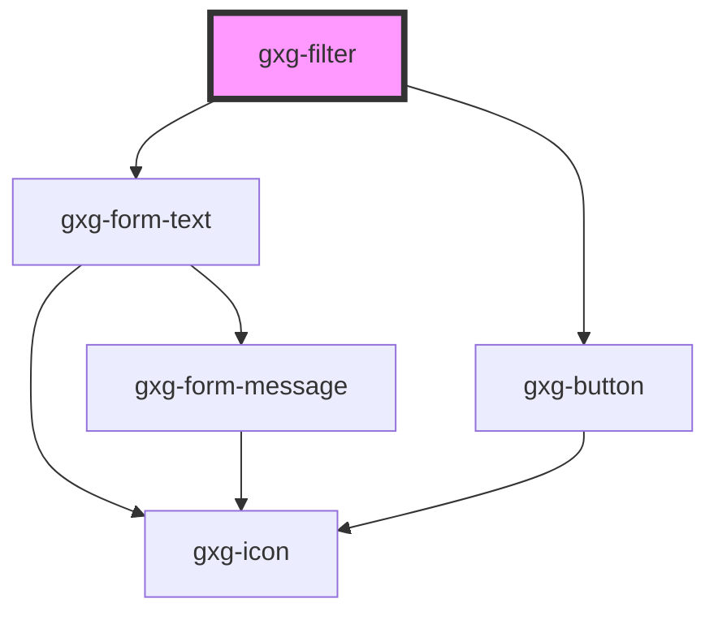

# gxg-filter-item

The content of the <code>gxg-filter-item</code> has to be passed as slotted content.

## Properties

| Property | Attribute | Description         | Type  | Default     |
| -------- | --------- | ------------------- | ----- | ----------- |
| `type`   | `type`    | The type (optional) | `any` | `undefined` |

## Events

| Event              | Description                                                                                                 | Type               |
| ------------------ | ----------------------------------------------------------------------------------------------------------- | ------------------ |
| `itemClickedEvent` | This event is fired when the user clicks on an item. event.detail carries the item type property, and text. | `CustomEvent<any>` |

# gxg-filter

<!-- Auto Generated Below -->

## Properties

| Property | Attribute | Description                                                                             | Type     | Default |
| -------- | --------- | --------------------------------------------------------------------------------------- | -------- | ------- |
| `left`   | `left`    | The left position of the filter, relative to the closest parent with relative position. | `string` | `"0px"` |
| `top`    | `top`     | The top position of the filter, relative to the closest parent with relative position.  | `string` | `"0px"` |

## Dependencies

### Depends on

- [gxg-form-text](../form-text)
- [gxg-button](../button)

### Graph

---

_Built with [StencilJS](https://stenciljs.com/)_
