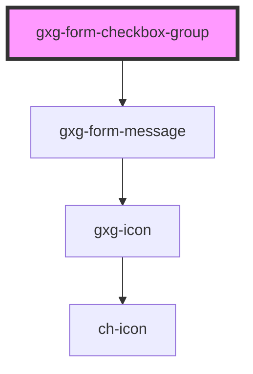

# gxg-form-checkbox-group

<!-- Auto Generated Below -->

## Properties

| Property             | Attribute             | Description                                                                                                                                                    | Type                                                   | Default           |
| -------------------- | --------------------- | -------------------------------------------------------------------------------------------------------------------------------------------------------------- | ------------------------------------------------------ | ----------------- |
| `disabled`           | `disabled`            | The presence of this attribute makes all the checkboxes disabled                                                                                               | `boolean`                                              | `false`           |
| `informationMessage` | `information-message` | An informative message to help the user filling the information                                                                                                | `string`                                               | `undefined`       |
| `row`                | `row`                 | The presence of this attribute makes the checkboxes be displayed with flex "row", instead of flex "column"                                                     | `boolean`                                              | `undefined`       |
| `validationMessage`  | `validation-message`  | The required message if this input is required and no value is provided (optional). If this is not provided, the default browser required message will show up | `string`                                               | `undefined`       |
| `validationStatus`   | `validation-status`   | The validation status                                                                                                                                          | `"error" \| "indeterminate" \| "success" \| "warning"` | `"indeterminate"` |

## Events

| Event                | Description | Type                          |
| -------------------- | ----------- | ----------------------------- |
| `groupValuesChanged` |             | `CustomEvent<CheckboxInfo[]>` |

## Methods

### `getValues() => Promise<CheckboxesGroupValues>`

Returns CheckboxesGroupValues = CheckboxInfo[];

#### Returns

Type: `Promise<CheckboxesGroupValues>`

## Dependencies

### Depends on

- [gxg-form-message](../form-message)

### Graph

---

_Built with [StencilJS](https://stenciljs.com/)_
