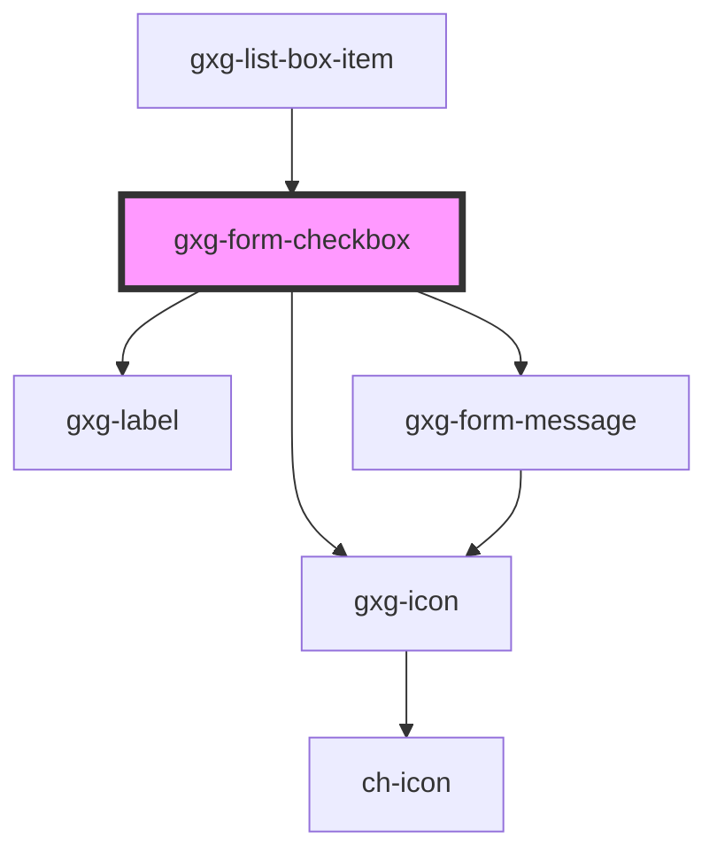

# gxg-form-checkbox

<h2>Notes</h2>
<ol>
    <li>The checkboxes do not have any margin around. To set spacing between, you should wrap them inside a <a href="?path=/info/layout-spacer-layout--spacer-layout">gxg-spacer-layout</a> and set to it the following attributes :
     <ul>
      <li><code>orientation</code>: vertical or horizontal</li>
      <li><code>space</code>: the desired spacing between the checkboxes. possible values: xs, s, m.  Recommended spacing for vertical orientation is "s". Recommended spacing for horizontal orientation is "m"</li>
     </ul>
    </li>
</ol>

<!-- Auto Generated Below -->

## Properties

| Property                   | Attribute                    | Description                                                                                                                                | Type                                                   | Default     |
| -------------------------- | ---------------------------- | ------------------------------------------------------------------------------------------------------------------------------------------ | ------------------------------------------------------ | ----------- |
| `checkboxId`               | `checkbox-id`                | The checkbox id                                                                                                                            | `string`                                               | `undefined` |
| `checked`                  | `checked`                    | The presence of this attribute makes the checkbox checked by default                                                                       | `boolean`                                              | `false`     |
| `disabled`                 | `disabled`                   | The presence of this attribute disables the checkbox                                                                                       | `boolean`                                              | `false`     |
| `displayValidationMessage` | `display-validation-message` | The presence of this attribute will display validation styles, such as a red, orange, or green border dependening on the validation status | `boolean`                                              | `false`     |
| `displayValidationStyles`  | `display-validation-styles`  | The presence of this attribute will display validation styles, such as a red, orange, or green border dependening on the validation status | `boolean`                                              | `false`     |
| `errorCondition`           | --                           | A function that will return true or false depending on wether the error condition is met or not                                            | `Function`                                             | `undefined` |
| `iconName`                 | `icon-name`                  | The checkbox icon                                                                                                                          | `string`                                               | `undefined` |
| `indeterminate`            | `indeterminate`              | The presence of this attribute makes the checkbox indeterminate                                                                            | `boolean`                                              | `false`     |
| `informationMessage`       | `information-message`        | An informative message to help the user filling the information                                                                            | `string`                                               | `undefined` |
| `label`                    | `label`                      | The checkbox label                                                                                                                         | `string`                                               | `undefined` |
| `name`                     | `name`                       | The checkbox name                                                                                                                          | `string`                                               | `undefined` |
| `required`                 | `required`                   | The presence of this attribute makes the commbo required                                                                                   | `boolean`                                              | `false`     |
| `validateOnChange`         | `validate-on-change`         | The presence of this attribute will check the input validity on every user input                                                           | `boolean`                                              | `false`     |
| `validationMessage`        | `validation-message`         | The message to display when validation fails (error)                                                                                       | `string`                                               | `undefined` |
| `validationStatus`         | `validation-status`          | The validation status                                                                                                                      | `"error" \| "indeterminate" \| "success" \| "warning"` | `undefined` |
| `value`                    | `value`                      | The checkbox value                                                                                                                         | `string`                                               | `undefined` |
| `warningCondition`         | --                           | A function that will return true or false depending on wether the warning condition is met or not                                          | `Function`                                             | `undefined` |

## Events

| Event    | Description | Type                                           |
| -------- | ----------- | ---------------------------------------------- |
| `change` |             | `CustomEvent<{ id: string; value: boolean; }>` |

## Methods

### `validate() => Promise<boolean>`

---

METHODS

---

#### Returns

Type: `Promise<boolean>`

## Shadow Parts

| Part    | Description |
| ------- | ----------- |
| `"box"` |             |

## Dependencies

### Used by

- [gxg-list-box-item](../list-box-item)

### Depends on

- [gxg-icon](../icon)
- [gxg-label](../label)
- [gxg-form-message](../form-message)

### Graph

---

_Built with [StencilJS](https://stenciljs.com/)_
