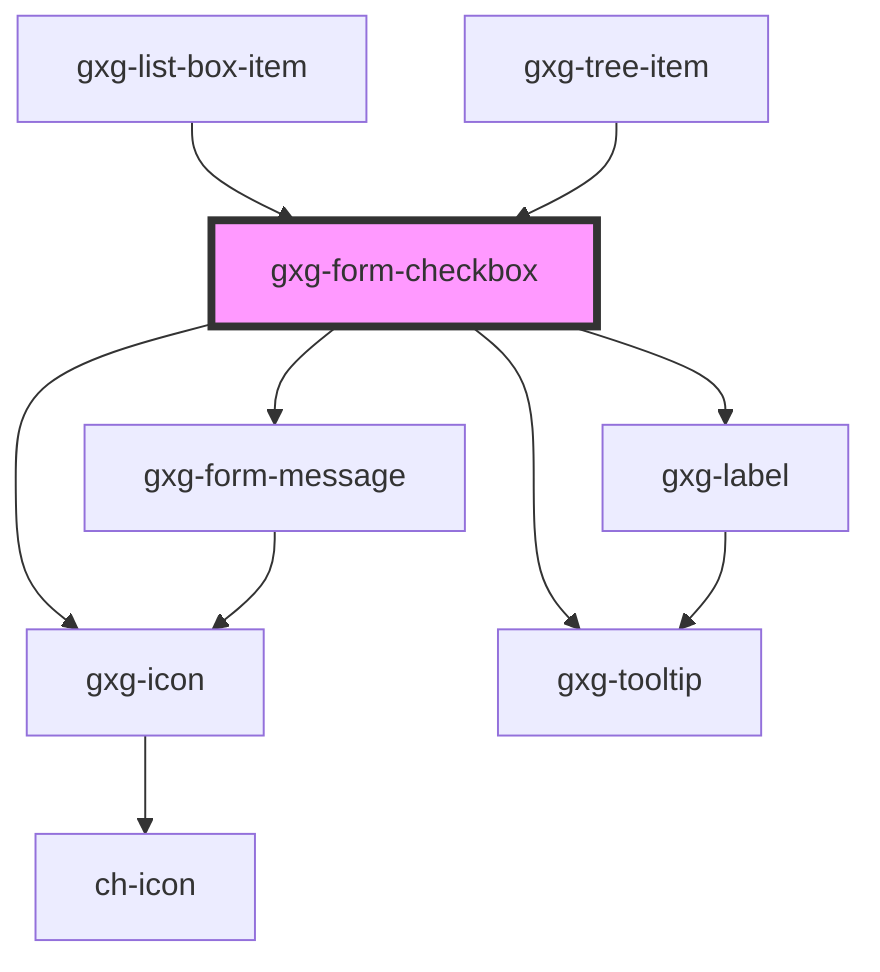

# gxg-form-checkbox

<h2>Notes</h2>
<ol>
    <li>The checkboxes do not have any margin around. To set spacing between, you should wrap them inside a <a href="?path=/info/layout-spacer-layout--spacer-layout">gxg-spacer-layout</a> and set to it the following attributes :
     <ul>
      <li><code>orientation</code>: vertical or horizontal</li>
      <li><code>space</code>: the desired spacing between the checkboxes. possible values: xs, s, m.  Recommended spacing for vertical orientation is "s". Recommended spacing for horizontal orientation is "m"</li>
     </ul>
    </li>
</ol>

<!-- Auto Generated Below -->

## Properties

| Property             | Attribute             | Description                                                                     | Type                                                   | Default           |
| -------------------- | --------------------- | ------------------------------------------------------------------------------- | ------------------------------------------------------ | ----------------- |
| `alignTop`           | `align-top`           | Aligns the checkbox to the top of the label (useful when the label is too long) | `boolean`                                              | `false`           |
| `checkboxId`         | `checkbox-id`         | The checkbox id                                                                 | `string`                                               | `undefined`       |
| `checked`            | `checked`             | The presence of this attribute makes the checkbox checked by default            | `boolean`                                              | `false`           |
| `disabled`           | `disabled`            | The presence of this attribute disables the checkbox                            | `boolean`                                              | `false`           |
| `iconName`           | `icon-name`           | The checkbox icon                                                               | `string`                                               | `undefined`       |
| `indeterminate`      | `indeterminate`       | The presence of this attribute makes the checkbox indeterminate                 | `boolean`                                              | `false`           |
| `informationMessage` | `information-message` | An informative message to help the user filling the information                 | `string`                                               | `undefined`       |
| `label`              | `label`               | The checkbox label                                                              | `string`                                               | `undefined`       |
| `labelSize`          | `label-size`          | The checkbox label size                                                         | `"large" \| "regular"`                                 | `"regular"`       |
| `name`               | `name`                | The checkbox name                                                               | `string`                                               | `undefined`       |
| `required`           | `required`            | The presence of this attribute makes the commbo required                        | `boolean`                                              | `false`           |
| `tooltip`            | `tooltip`             |                                                                                 | `string`                                               | `undefined`       |
| `validationMessage`  | `validation-message`  | The message to display when validation fails (error)                            | `string`                                               | `undefined`       |
| `validationStatus`   | `validation-status`   | The validation status                                                           | `"error" \| "indeterminate" \| "success" \| "warning"` | `"indeterminate"` |
| `value`              | `value`               | The checkbox value                                                              | `string`                                               | `undefined`       |

## Events

| Event    | Description | Type                                                               |
| -------- | ----------- | ------------------------------------------------------------------ |
| `change` |             | `CustomEvent<{ id: string; value: boolean; disabled?: boolean; }>` |

## Shadow Parts

| Part    | Description |
| ------- | ----------- |
| `"box"` |             |

## Dependencies

### Used by

 - [gxg-list-box-item](../list-box-item)
 - [gxg-tree-item](../tree-item)

### Depends on

- [gxg-icon](../icon)
- [gxg-label](../label)
- [gxg-form-message](../form-message)
- [gxg-tooltip](../tooltip)

### Graph

----------------------------------------------

*Built with [StencilJS](https://stenciljs.com/)*
