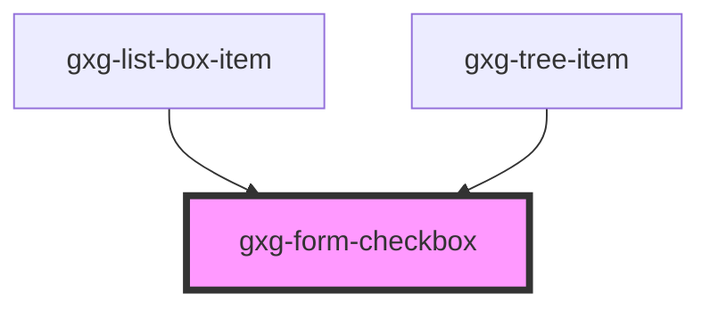

# gxg-form-checkbox

<h2>Notes</h2>
<ol>
    <li>The checkboxes do not have any margin around. To set spacing between, you should wrap them inside a <a href="?path=/info/layout-spacer-layout--spacer-layout">gxg-spacer-layout</a> and set to it the following attributes :
     <ul>
      <li><code>orientation</code>: vertical or horizontal</li>
      <li><code>space</code>: the desired spacing between the checkboxes. possible values: xs, s, m.  Recommended spacing for vertical orientation is "s". Recommended spacing for horizontal orientation is "m"</li>
     </ul>
    </li>
</ol>

<!-- Auto Generated Below -->

## Properties

| Property        | Attribute       | Description                                                          | Type      | Default     |
| --------------- | --------------- | -------------------------------------------------------------------- | --------- | ----------- |
| `checkboxId`    | `checkbox-id`   | The checkbox id                                                      | `string`  | `undefined` |
| `checked`       | `checked`       | The presence of this attribute makes the checkbox checked by default | `boolean` | `false`     |
| `disabled`      | `disabled`      | The presence of this attribute disables the checkbox                 | `boolean` | `false`     |
| `indeterminate` | `indeterminate` | The presence of this attribute makes the checkbox indeterminate      | `boolean` | `false`     |
| `label`         | `label`         | The checkbox label                                                   | `string`  | `undefined` |
| `name`          | `name`          | The checkbox name                                                    | `string`  | `undefined` |
| `value`         | `value`         | The checkbox value                                                   | `string`  | `undefined` |

## Events

| Event    | Description | Type               |
| -------- | ----------- | ------------------ |
| `change` |             | `CustomEvent<any>` |

## Dependencies

### Used by

- [gxg-list-box-item](../list-box-item)
- [gxg-tree-item](../tree-item)

### Graph

---

_Built with [StencilJS](https://stenciljs.com/)_
