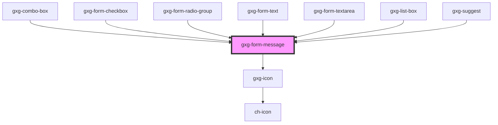

# gxg-form-message

<h2>Notes</h2>
<ul>
    <li>The <code>gxg-form-message</code> component is intended to be used inside form related components, in order to display warning or error messages relative to the fields validation.</li>
    <li>Just append a <code>gxg-form-message</code> inside a gxg-form-x component with the following attributes: <code>type="warning"</code> or <code>"error"</code>, and <code>slot="message"</code></li>
</ul>
<!-- Auto Generated Below -->

## Properties

| Property | Attribute | Description         | Type                                                   | Default           |
| -------- | --------- | ------------------- | ------------------------------------------------------ | ----------------- |
| `type`   | `type`    | The type of message | `"error" \| "indeterminate" \| "success" \| "warning"` | `"indeterminate"` |

## Dependencies

### Used by

- [gxg-combo-box](../combo-box)
- [gxg-form-checkbox](../form-checkbox)
- [gxg-form-radio-group](../form-radio-group)
- [gxg-form-text](../form-text)
- [gxg-form-textarea](../form-textarea)
- [gxg-list-box](../list-box)
- [gxg-suggest](../suggest)

### Depends on

- [gxg-icon](../icon)

### Graph

---

_Built with [StencilJS](https://stenciljs.com/)_
