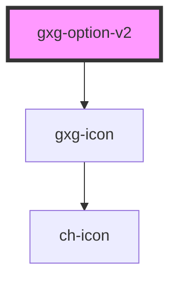

# gxg-option-v2

<!-- Auto Generated Below -->

## Properties

| Property   | Attribute   | Description                                                         | Type      | Default     |
| ---------- | ----------- | ------------------------------------------------------------------- | --------- | ----------- |
| `iconName` | `icon-name` | The icon name (optional)                                            | `string`  | `undefined` |
| `selected` | `selected`  | The presence of this attribute makes the option selected by default | `boolean` | `undefined` |
| `value`    | `value`     | The value                                                           | `string`  | `undefined` |

## Events

| Event              | Description | Type               |
| ------------------ | ----------- | ------------------ |
| `optionIsSelected` |             | `CustomEvent<any>` |

## Dependencies

### Depends on

- [gxg-icon](../icon)

### Graph

---

_Built with [StencilJS](https://stenciljs.com/)_
