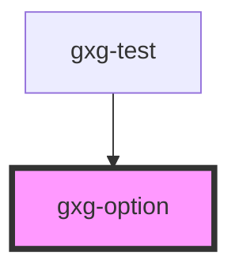

# gxg-option

<!-- Auto Generated Below -->

## Properties

| Property   | Attribute  | Description                                                         | Type      | Default     |
| ---------- | ---------- | ------------------------------------------------------------------- | --------- | ----------- |
| `selected` | `selected` | The presence of this attribute makes the option selected by default | `boolean` | `undefined` |
| `value`    | `value`    | The value                                                           | `string`  | `undefined` |

## Dependencies

### Used by

- [gxg-test](../test)

### Graph

---

_Built with [StencilJS](https://stenciljs.com/)_
