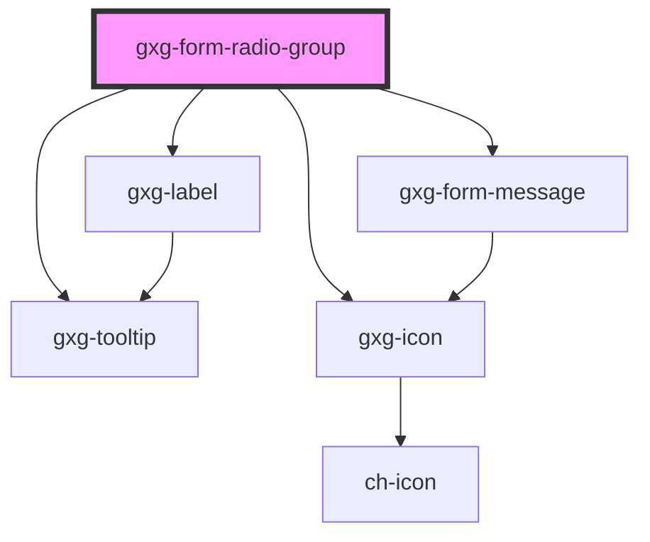

# gxg-form-radio-group

<!-- Auto Generated Below -->

## Properties

| Property             | Attribute             | Description                                                                                                                                                    | Type                                                   | Default           |
| -------------------- | --------------------- | -------------------------------------------------------------------------------------------------------------------------------------------------------------- | ------------------------------------------------------ | ----------------- |
| `center`             | `center`              | Centers the radios if 'row' is true                                                                                                                            | `boolean`                                              | `false`           |
| `disabled`           | `disabled`            | The presence of this attribute makes the input disabled                                                                                                        | `boolean`                                              | `false`           |
| `informationMessage` | `information-message` | An informative message to help the user filling the information                                                                                                | `string`                                               | `undefined`       |
| `label`              | `label`               | The radio group label                                                                                                                                          | `string`                                               | `undefined`       |
| `radiosLabelSize`    | `radios-label-size`   |                                                                                                                                                                | `"large" \| "regular"`                                 | `"regular"`       |
| `required`           | `required`            | Make the radio-buttons required                                                                                                                                | `boolean`                                              | `false`           |
| `row`                | `row`                 | The presence of this attribute makes the radios be displayed with flex "row", instead of flex "column"                                                         | `boolean`                                              | `undefined`       |
| `validationMessage`  | `validation-message`  | The required message if this input is required and no value is provided (optional). If this is not provided, the default browser required message will show up | `string`                                               | `undefined`       |
| `validationStatus`   | `validation-status`   | The validation status                                                                                                                                          | `"error" \| "indeterminate" \| "success" \| "warning"` | `"indeterminate"` |
| `value`              | `value`               | The radio group checked radio value                                                                                                                            | `string`                                               | `undefined`       |

## Events

| Event    | Description                                        | Type                                           |
| -------- | -------------------------------------------------- | ---------------------------------------------- |
| `change` | Emits the value when is changed, and the radio id. | `CustomEvent<{ value: string; id?: string; }>` |

## Dependencies

### Depends on

- [gxg-label](../label)
- [gxg-form-message](../form-message)
- [gxg-tooltip](../tooltip)
- [gxg-icon](../icon)

### Graph

----------------------------------------------

*Built with [StencilJS](https://stenciljs.com/)*
