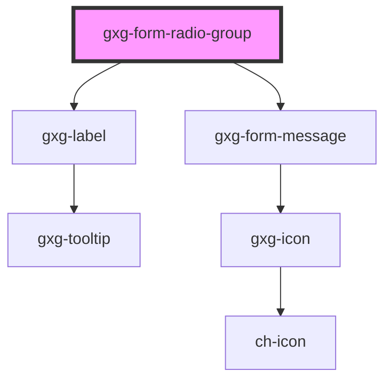

# gxg-form-radio-group

<!-- Auto Generated Below -->

## Properties

| Property                   | Attribute                    | Description                                                                                                                                                    | Type                                                   | Default     |
| -------------------------- | ---------------------------- | -------------------------------------------------------------------------------------------------------------------------------------------------------------- | ------------------------------------------------------ | ----------- |
| `disabled`                 | `disabled`                   | The presence of this attribute makes the input disabled                                                                                                        | `boolean`                                              | `false`     |
| `displayValidationMessage` | `display-validation-message` | The presence of this attribute will display validation styles, such as a red, orange, or green border dependening on the validation status                     | `boolean`                                              | `false`     |
| `displayValidationStyles`  | `display-validation-styles`  | The presence of this attribute will display validation styles, such as a red, orange, or green border dependening on the validation status                     | `boolean`                                              | `false`     |
| `errorCondition`           | --                           | A function that will return true or false depending on wether the error condition is met or not                                                                | `Function`                                             | `undefined` |
| `informationMessage`       | `information-message`        | An informative message to help the user filling the information                                                                                                | `string`                                               | `undefined` |
| `label`                    | `label`                      | The radio group label                                                                                                                                          | `string`                                               | `undefined` |
| `required`                 | `required`                   | Make the radio-buttons required                                                                                                                                | `boolean`                                              | `false`     |
| `row`                      | `row`                        | The presence of this attribute makes the radios be displayed with flex "row", instead of flex "column"                                                         | `boolean`                                              | `undefined` |
| `validationMessage`        | `validation-message`         | The required message if this input is required and no value is provided (optional). If this is not provided, the default browser required message will show up | `string`                                               | `undefined` |
| `validationStatus`         | `validation-status`          | The validation status                                                                                                                                          | `"error" \| "indeterminate" \| "success" \| "warning"` | `undefined` |
| `value`                    | `value`                      | The radio group checked radio value                                                                                                                            | `string`                                               | `undefined` |
| `warningCondition`         | --                           | A function that will return true or false depending on wether the warning condition is met or not                                                              | `Function`                                             | `undefined` |

## Methods

### `validate() => Promise<boolean>`

---

METHODS

---

#### Returns

Type: `Promise<boolean>`

## Dependencies

### Depends on

- [gxg-label](../label)
- [gxg-form-message](../form-message)

### Graph

---

_Built with [StencilJS](https://stenciljs.com/)_
